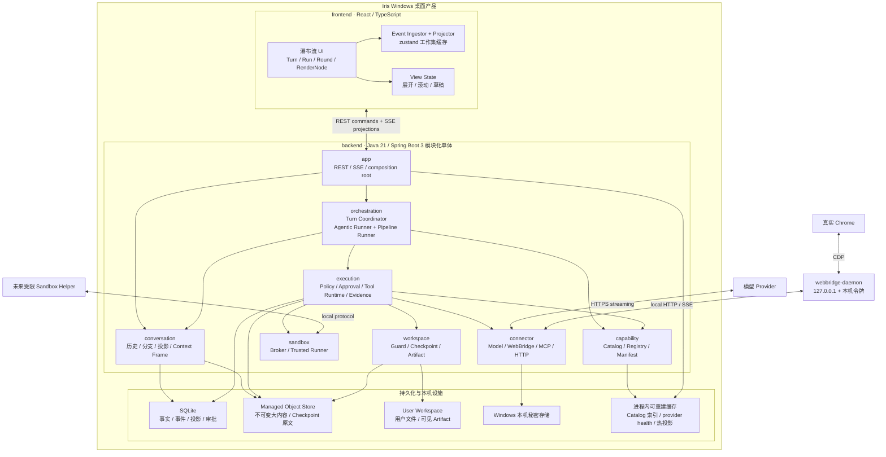
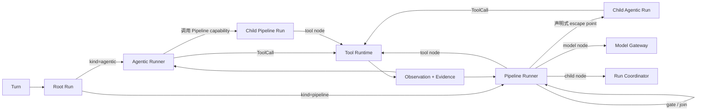
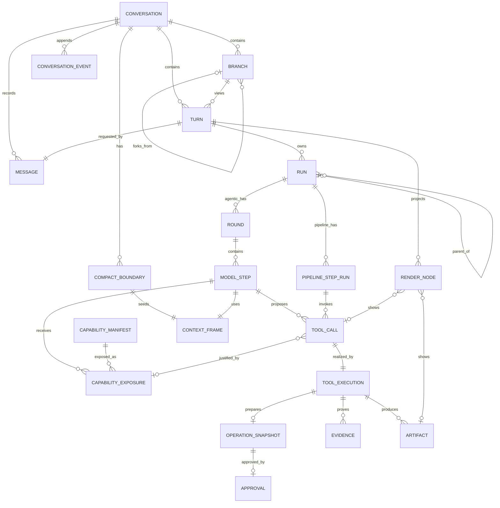
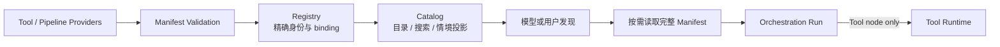
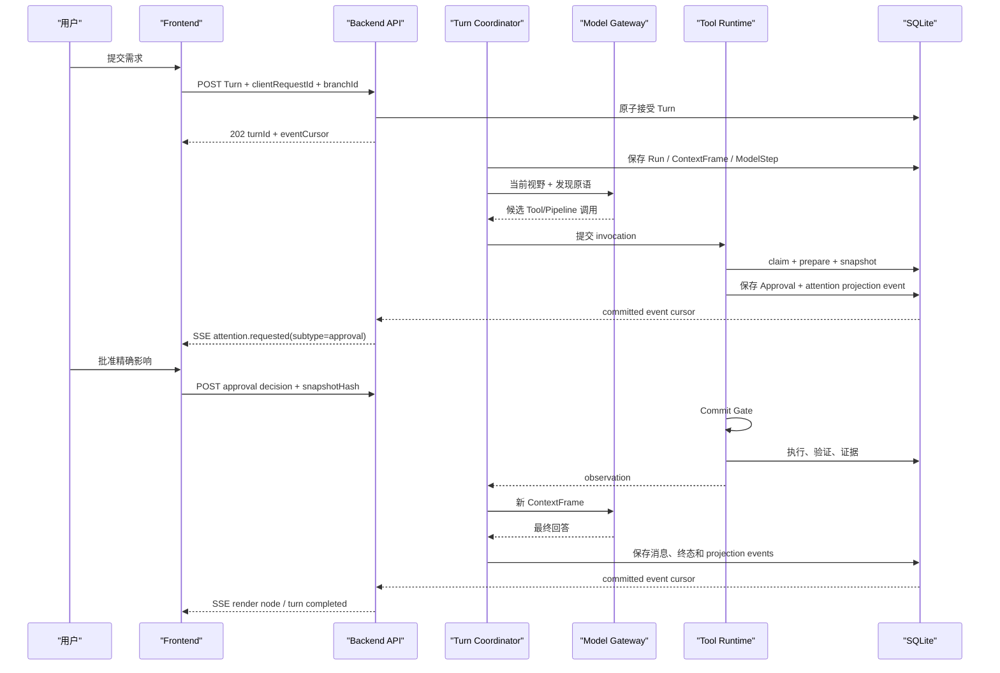

# 02 · Iris 总体架构

> 状态：大陆 0 / 节点 0.4 架构定稿候选
>
> 目标：把瀑布流前端、Agentic 内核、Pipeline、工具平台、工作区、沙箱和 WebBridge 熔铸为一套可实现、可恢复、不过度设计的个人 AI 助手架构。
>
> 本文是总体边界的主文档；前后端字段和事件见 [08 · API 契约](08-api-contract.md)，研究证据见 [12 · Agentic 内核研究](12-agent-kernel-study.md) 与 [13 · 后端研究](13-backend-study.md)。

## 1. 一句话架构

Iris 是一个本地优先的 Windows 个人助手：

```text
React 前端只提交人的意图并渲染持久化投影
                         ↓ REST 命令 / SSE 事件
Java 后端持有 Conversation、Agentic/Pipeline Run、Tool Runtime 和完整历史
                         ↓ 统一受控执行
Workspace / Sandbox / WebBridge / 外部 API 接触真实世界
```

核心 Loop **只在后端**。前端不是另一个 Agent，不直连模型、不执行 Tool、不判断审批是否有效，也不从消息文本猜运行状态。

## 2. 五条不变量怎样落到架构里

| 不变量 | 架构约束 |
|---|---|
| 历史不可丢 | SQLite 保存 canonical history、分支、压缩边界、运行与工具事实；优化只重建 Context Frame 和 UI projection |
| 发现优于塞满 | 模型默认只得到发现原语；Catalog 可搜索，Registry 精确绑定，Tool schema 按需读取 |
| 写操作必审批 | 所有副作用只经过 Tool Runtime；批准绑定不可变 Operation Snapshot，不能由调用方自报 |
| 路径围栏 | WorkspaceGuard 只接受唯一根下的逻辑路径，逐层检查链接并 fail-close |
| 视觉克制 | 后端给出稳定 Turn/Run/Node 投影；前端动画只表达已发生的状态变化和注意力锚点 |

这五条不是“最好做到”，而是模块依赖、持久化状态和 API 形状都不能绕过的约束。

## 3. 系统模块图



### 3.1 进程边界

首版只接受三个有理由的进程边界：

1. `frontend` 最终由桌面壳承载；
2. `backend` 是拥有产品事实的 Java 模块化单体；
3. `webbridge-daemon` 因浏览器身份、崩溃隔离和 CDP 生命周期独立运行。

真正的任意代码隔离若落地，应是第四个受限 helper。普通 `python.exe` 子进程只能叫 Trusted Runner，不能冒充安全沙箱。

### 3.2 数据层与缓存层

Iris 不用一种介质承载所有数据，而按语义和访问形态分三层：

| 层 | 保存什么 | 不保存什么 |
|---|---|---|
| SQLite | Conversation、Run、ToolExecution、Capability Definition、路径、版本、hash、状态机、引用与索引 | 大段 Tool output、Checkpoint 原文字节、用户文件 |
| Managed Object Store | 按内容寻址的不可变字节，如完整 Tool output、Checkpoint 原文、内部 Artifact payload | 可变业务状态、目录树、用户可直接编辑的文件 |
| User Workspace | 用户理解并拥有的文件、显式发布的 Artifact | Iris 内部缓存、对话 payload、Checkpoint 私有副本 |

语义身份不暴露物理路径。模型和历史使用 `workspace://`、`capability://`、
`tool-result://`、`checkpoint://` 等稳定引用；SQLite 把这些身份连接到当前版本和
`objectRef`，Managed Object Store 再把 `objectRef` 映射为受保护物理文件。对象先以
内容 hash 原子落盘，再提交 SQL 引用；中断最多产生以后可回收的孤儿对象，不能产生
指向未落盘内容的有效事实。

Capability Catalog 与 Workspace 都属于语义组织，但两者不是同一棵树：

- Workspace 路径组织用户对象，允许在审批后改变内容；
- Capability 路径组织模型可发现的能力，Definition version 不可变，当前 binding
  与可重建搜索索引是另外的状态；
- Java package 只负责推导本地 provider 的初始能力路径，不是历史身份；SQL 保存
  已被引用的 Definition snapshot/hash，保证实现离线、移动或升级后历史仍可解释。

秘密进入 Windows Credential Manager、DPAPI 包装存储或后续验证过的等价机制，不进入
SQLite 明文字段，也不进入 Managed Object Store。

“SQLite 是首版真相”是当前实现基线，不是对最终存储形态的永久承诺。Iris 后续必须用真实
负载评估整条数据路径：token/event 写放大、单写者等待、ConversationView 水合 P95、
长历史索引体积、崩溃恢复时间和投影重建成本。只有测量证明结构化事实表成为瓶颈时，
才比较批量事件、追加日志（如 JSONL）、冷热分层或更适合 Agent 工作负载的存储；任何
替换仍须保留事务 claim、幂等、审批竞争、条件状态迁移和可重建投影这些语义。不能只因
“追加文件更原生”就把数据库能力搬进应用代码重造。

首版缓存全部在进程内且可丢失：

- Capability 文本索引；
- 已验证 Manifest 的只读映射；
- provider 健康状态；
- 热 ConversationView。

活动执行的取消句柄、SSE subscriber 和本地进程 handle 是另一类 **ephemeral runtime handles**：它们不可重建，重启后由持久化 Run/ToolExecution 状态决定重新附着、恢复、验证或标记未知，不能把“重新创建一个内存对象”当作恢复原执行。

缓存必须能从 Registry provider、SQLite 和配置重建。Iris 不引入 Redis、消息队列或分布式锁。

## 4. Loop 的唯一位置

### 4.1 决定

核心 Loop 在 Java 后端，具体拥有：

- User Turn 接受和幂等；
- Context Frame 规划；
- 模型调用、重试和降级；
- Capability 发现；
- Tool Invocation；
- 审批等待与恢复；
- Pipeline/Agentic 子运行；
- 停止、超时和未知结果；
- canonical history 与 projection event。

前端只拥有：

- 人的命令：发送、补充、停止、批准、拒绝、选择分支；
- 结构化事件 reducer；
- 当前屏幕所需的读模型缓存；
- 可丢弃的展开、滚动、主题、草稿和模态框状态。

### 4.2 为什么不能再有前端 Loop

如果前端持有 Loop，刷新或窗口关闭会同时丢失模型步骤、工具等待者和审批上下文；WebBridge、定时任务或未来后台 Run 也无法共享同一事实源。更严重的是，前端会自然产生 `/api/chat/proxy` 和 `/api/tools/invoke` 两条可绕过后端状态机的通路。

Iris 因此不向前端公开“把任意 messages 和 tools 原样转发给模型”的 API。前端提交的是 User Turn；后端决定当前模型视野和可见能力。

### 4.3 SSE 的职责

SSE 是唯一流式投影通道，但不是执行真相：

```text
先提交 SQLite 事实和 conversation event
→ 再向在线 subscriber 投影
→ 断线后从 event cursor 重放
```

SSE 断开只代表观察者离线，不自动等于取消 Turn。停止必须是显式命令。

## 5. Pipeline 与 Agentic：两种求解形态，一个运行内核

### 5.1 不是二选一

Iris 暂时使用以下工作定义：

| 形态 | 擅长 | 代价 |
|---|---|---|
| `Agentic Run` | 面对未知路径，观察环境、选择原语、试错、修正并求解 | 成本高，路径不稳定，需要更强预算和恢复 |
| `Pipeline Run` | 重放已经理解的成功过程，固定输入输出、步骤、检查点和证据 | 灵活性低，定义需要维护，遇到新情境会失配 |

Pipeline 不等于“没有模型”。它固定的是成功过程的控制骨架：

- 标题生成：User Turn 摘要 + Conversation metadata → Model transform → title metadata；
- Context 压缩：选定事实与历史 → Model summary/structure → Context Frame + CompactBoundary；
- RAG：问题 → 检索 → 重排 → Model synthesis → evidence-backed answer；
- 已验证生活流程：结构化输入 → 固定观察/动作/审批/验证 → Artifact 或外部结果。

这些模型步骤的输入来源、输出去向、失败处理和谁能看见是确定的；Agentic Run 则在运行时选择下一条路。

二者可以：

- Agentic Run 调用已注册 Pipeline；
- Pipeline 在一个明确边界调用受预算限制的 Agentic segment；
- 多个 Agentic/Pipeline 子 Run 并行；
- Agentic 探索得到的成功轨迹，经验证后沉淀为 Pipeline；
- Pipeline 发现前置条件失效时，返回结构化缺口，由父 Agentic Run 决定修复或重新探索。

这不是 ragent-lab 现有关键词路由的复制，而是 Iris 需要继续用真实生活任务验证的研究模型。

### 5.2 统一的 Run 模型



所有 Run 共用：

- `runId / parentRunId / invokingStepId`；
- `kind / definitionId / definitionVersion`；
- Pipeline Run 接受时冻结 Definition snapshot/hash、规范化 input hash 和解析后的依赖版本；重启不重新按 Catalog 排序或 alias 解析；
- durable phase、预算、取消与错误；
- input/output reference；
- ordered event；
- child run 和并行组；
- evidence 与终态。

差异只在调度方式：

- Agentic Runner 产生 `ModelStep` 和 `Round`，下一步由模型基于观察决定；
- Pipeline Runner 读取已版本化 Definition，执行固定 Step 和 join 条件；
- 两者都不能直调 executor，真实动作统一交给 Tool Runtime。

Pipeline 不是一个“巨型 Tool”，也不产生覆盖全部步骤的 ToolExecution。每个 tool node 单独产生 ToolCall/ToolExecution；model node 进入 Model Gateway；child node 创建 Run；gate/join 只由 Pipeline Runner 解释。

首版不实现一个包罗万象的 DAG 平台。`Run` 是必要的持久化共同语言；Pipeline 可以先由 Java 代码和少量明确 descriptor 实现，等真实重复流程出现再决定 DSL。

### 5.3 原语完备是方向，不是假定

加减乘除之所以能组成复杂计算，是因为它们拥有清晰语义和可验证结果。生活工具要接近这种“求解器土壤”，至少需要六类原语：

1. **观察**：读取文件、页面状态、搜索、查询外部对象；
2. **变换**：计算、解析、模型结构化转换、文档处理；
3. **行动**：写文件、发送、提交、浏览器操作；
4. **验证**：重新读取、比较 hash、检查页面确认和业务编号；
5. **协作**：等待、澄清、审批、授权和人工接管；
6. **恢复**：Checkpoint、幂等查询、reconcile 和显式补偿。

“工具多”不等于原语完备。真正的判断是：Agent 遇到一个新任务时，能否观察缺口、构造动作、得到客观反馈，并在失败后定位是工具缺失、契约不好还是策略错误。

能力设计分两层，但共享 Catalog 与运行边界：

- **系统原语能力**：读文件、页面观察、结构化变换、资源写入、验证等客观小动作；追求语义清晰、结果可验证、组合时不夹带领域假设；
- **生活领域能力**：围绕求职、出行、财务、整理等真实任务抽象出的可发现能力；可以是 Tool、Pipeline 或 guidance，但必须说明适用情境、前置条件、证据和失败出口。

Agentic 内核是通往两层能力网络的基础求解器，而不是终点。前期先把发现、组合、上下文和恢复做可靠；后期主要研发对象将转向“具体生活能力怎样抽象才真正有效”，而不是继续无限扩建通用 Loop。

### 5.4 Agentic 仍是首要入口

自然语言生活需求默认进入 Agentic Turn，不先用关键词猜某条 Pipeline。稳定 Pipeline 通过 Catalog 成为一种 Capability，由 Agent 发现并调用。只有两类情况可以直接进入 Pipeline：

- 用户通过显式按钮、命令或结构化表单选择了某个版本化 Pipeline；
- 系统内部有确定触发条件，例如标题生成、Context 压缩或索引重建。

这样既保留 WonWork 当前“Agentic 首要”的探索能力，也让成熟过程能逐渐降低成本。

### 5.5 从轨迹到 Pipeline

一次成功不能自动变成 Pipeline。轨迹首先是历史证据，最多进入以下候选生命周期：

```text
Trace
→ Candidate Recipe
→ Reviewable Draft
→ Evaluated
→ Published(versioned)
→ Stale / Deprecated
```

其中必须完成：识别可重复目标和稳定前置条件；抽离偶然数据并定义 input/output；标注资源声明、审批点、验证和恢复；在安全数据或 dry-run 上复放；由人明确发布一个版本；最后才注册为可发现 Capability。

不得自动固化：

- 只成功一次、靠偶然页面状态走通的路径；
- 包含未声明人工判断的路径；
- 结果只能靠“模型说成功”证明的路径；
- 把秘密、个人数据或临时 selector 写死的路径；
- 为了复现轨迹而绕开 Runtime 的路径。

后续可以研究轨迹建议器，但首版不做自动流程挖掘和自动发布。

### 5.6 串行、并行与嵌套

默认串行。并行只在计划器能给出独立 Resource Claims、审批互不依赖且结果 join 规则明确时开启。

同一并行组的结果：

- 完成事件按真实时间保存；
- 下一次模型观察按计划 ordinal 稳定排序；
- 必需成员全部终止后才形成完整 join observation；
- 某个写动作结果未知时，相关资源保持占用，不能靠重试制造第二次副作用。

Run 嵌套必须有最大深度、token/时间/工具预算和循环检测。Pipeline 调 Agentic 不是“失败就放开随便做”，而是在 Definition 声明的目标、可见能力、资源和终止条件内探索。

### 5.7 Pipeline 受控回退 Agentic

安全切换不是“当前 Step 看起来失败了”就立即放开 Agent。切面之前的全部 activity 必须已经终止，相关 Resource Claim 已释放或被显式转移，并且不能有 sibling 仍处于 `awaiting_commit / executing / verifying / outcome_unknown`。

满足全局安全切面后，还必须属于两类：

- 尚未发生副作用；
- 已完成步骤的 postcondition 已被证据证明。

回退创建 child Agentic Run，并携带 residual goal、已提交 Artifact/Evidence、允许的能力范围以及禁止重放的动作。child 只继承权限上限，不继承父 Run 的批准；它提出的每一个新动作仍重新 Prepare、审批和核验。常见触发包括输入超出覆盖域、工具或页面 schema 漂移、未建模分支、质量验证不足和用户改变目标。

ToolExecution 正在执行或处于 `OutcomeUnknown` 时，不能用 Agentic “再试一次”。必须先 verify/reconcile 或请人判断。Agentic 可以为当前 Run 生成临时修复，但不能静默修改已发布 Pipeline；长期修订进入新的 Candidate Recipe 和版本。

Pipeline 重启时从持久事实重建 ready-set：终态 Step 不重跑，未开始 Step 可以重新调度，执行中的写 Step 进入 unknown/reconcile，join 从 child terminal facts 重新计算。若冻结的 Definition 或 Tool binding 缺失，Run 进入 `suspended + capability_unavailable`；不得自动迁移版本，也不得未经安全切面直接切换 Agentic。

## 6. 后端逻辑模块

这些是一个 Spring Boot 工程内的 package 边界，不是八个 Maven module。

### 6.1 `app`

拥有 REST/SSE adapter、配置绑定和 composition root。它只把命令交给 application port，不拥有 Loop、SQL 业务规则或工具审批。

### 6.2 `conversation`

拥有：

- Conversation、Message、Turn、Branch、CompactBoundary；
- canonical event；
- Context Frame；
- ConversationView / TurnView 投影；
- SSE cursor 和重放。

它回答“发生过什么”和“当前观察者看到什么”，不执行外部动作。

### 6.3 `orchestration`

拥有：

- `TurnCoordinator`；
- `AgenticRunner`；
- `PipelineRunner`；
- Run / ModelStep / PipelineStepRun 生命周期；
- child run、并行 join、预算和停止传播。

它决定下一步求解策略，但不能绕过 Capability 和 Tool Runtime。

### 6.4 `capability`

拥有：

- `ToolManifest` 与未来的 `PipelineManifest / CapabilityCard`；
- 严格 Registry；
- 可重建 Catalog；
- 目录、搜索、schema 按需读取；
- provider 可用性和前置条件投影。

Catalog 是发现视图，Registry 才是精确执行绑定。

### 6.5 `execution`

拥有唯一副作用入口：

```text
normalize
→ validate manifest/schema/fence
→ durable idempotency claim
→ prepare + preflight
→ Operation Snapshot
→ policy + approval
→ Commit Gate
→ execute
→ verify
→ evidence / reconcile
```

审批、工具运行和未知结果都由 SQLite 状态机持久化。

### 6.6 `workspace`

拥有唯一工作区根、逻辑路径、逐层链接检查、版本前置条件、Checkpoint、原子写、Artifact 和显式恢复。

切换对话分支不会静默改文件。若用户希望文件世界回到某个历史锚点，Workspace 生成可预览的 restore Operation Snapshot，并走正常审批。

### 6.7 `sandbox`

拥有 staged input、独立 output、资源限制和 runner/broker 接口。普通子进程只允许受信脚本；真正开放任意模型代码前必须有操作系统级隔离。

### 6.8 `connector`

包含 Model provider、WebBridge、MCP 和外部 HTTP adapter。Connector 只翻译协议，不拥有审批、历史或另一套工具系统。

### 6.9 依赖规则

```text
app → conversation / orchestration
orchestration → conversation / capability / execution
execution → capability + workspace/sandbox/connector ports
adapters → owning module ports
```

禁止：

- Controller 直接调用 Tool；
- Pipeline 直接写数据库或文件；
- Connector 自己批准动作；
- Catalog 根据搜索排序改变执行身份；
- 一个全局 `common` 或 `DatabaseService` 成为任意依赖通道。

## 7. 前端边界

```text
frontend/src/
├── domain/chat/        # API 类型、event reducer、selectors
├── api/                # REST commands + SSE client
├── stores/
│   ├── chatStore       # 当前 ConversationView 工作集
│   ├── conversationStore
│   └── viewStateStore  # 可丢弃视图偏好
├── components/chat/    # Turn / Run / Round / RenderNode
└── renderers/          # 工具与 Artifact 安全渲染器
```

前端不再存在：

- `agenticLoop.ts`；
- 本地 Tool executor；
- provider messages 组装器；
- 用消息 role 猜 Turn/Round 的分组器；
- 依据自然语言或 DOM 猜审批、完成和错误的逻辑。

前端可以乐观显示“命令正在提交”，但只有后端 `turn.accepted`、`attention.updated(subtype=approval)` 等事件能确认事实。

## 8. 概念数据模型

这是一张领域关系图，不是最终 SQLite DDL。



### 8.1 三层真相

| 层 | 内容 | 能否重建 |
|---|---|---:|
| Canonical Facts | 消息、Turn、Run、Tool、审批、分支、压缩、证据 | 否，必须永久保留 |
| Durable Projection | ConversationView、RenderNode、安全摘要 | 是，可由事实和事件迁移重建 |
| Ephemeral View State | 展开、滚动、选中、草稿、面板尺寸 | 是，可丢弃 |

模型上下文不属于任何一层历史真相。每次 Model Step 都保存一个可追溯 `ContextFrame`，说明选入、排除、摘要和来源，但它只是当次视野。

### 8.2 Conversation、Branch 与 Message

- Conversation 是整棵长期历史，不是一条活动消息数组；
- Branch 保存 parent、fork anchor 和当前尾部引用，旧分支永不覆盖；
- Message 保存原始角色、内容块和工具协议结构；
- 选择 Branch 只改变当前视野；继续执行时 `POST Turn` 必须显式带 `branchId`。

### 8.3 Turn、Run、Round 与 Step

- Turn 是一次用户委托；
- Run 是一次可恢复求解过程，可为 Agentic 或 Pipeline；
- Round 只表达 Agentic 中一次“读取 Context → 模型输出 → 观察工具结果”的语义周期；
- PipelineStepRun 表达固定 Definition 的步骤实例；
- RenderNode 可以引用 `runId`，并按需要再引用 `roundId` 或 `pipelineStepRunId`。

因此 0.1 的 `Turn = N × Round` 是 Agentic 瀑布流的准确视图，但不是所有系统 Pipeline 的执行本体。0.4 增加 Run 这一层，避免把纯 Pipeline 伪装成模型轮次。

### 8.4 RenderNode

首版节点仍保持小联合类型：

- `thinking`
- `tool`
- `attention`
- `artifact`
- `answer`
- `supplement`
- `run`（只在需要展示 Pipeline/child Run 的整体进度时使用）

节点保存安全展示数据和来源 ID，大结果只保存引用。Pipeline 的内部每一步不必都变成可见节点；投影器只呈现能帮助用户监督、理解或验收的边界。

Artifact 还保存 provenance 与 visibility。内部 Pipeline 的输出先成为可追溯 Artifact/Fact，再显式发布给 `user_timeline`、`model_context` 或 `internal`；不因“模型或用户看不到”就从历史删除，也不把所有后台噪音强塞进瀑布流。

### 8.5 分支与压缩

分支和压缩都只改变“当前视野”：

- 分支选择一条历史路径；
- CompactBoundary 用稳定 event/message cutoff、source ContextFrame、summary Artifact 和结构化 fact refs 表达闭合边界；
- 原 Message、ToolCall、Run 和 Event 不删除；
- 在旧位置分叉时，ContextPlanner 选择该位置当时可用的最新 Boundary；
- Workspace restore 是独立受审批动作，不能和 UI 分支切换隐式绑定。

## 9. Tool 契约

### 9.1 Manifest

一个 Tool 注册前必须具有：

```text
identity
  id, name, version
  capabilityPath
  description

contract
  inputSchema
  outputSchema

safety
  riskLevel
  sideEffectKind
  approvalPolicy
  idempotencyPolicy
  resourceClaimPolicy

runtime
  timeout
  resultBudget
  executorBinding

outcome
  evidenceContract
  verificationPolicy
  recoveryHint
```

本地 Java Tool 的 `capabilityPath` 由 `tools/<domain>/<dir>/XxxTool.java` 的目录/package 派生，工具类不能手写第二份路径。远程 provider 使用显式稳定 namespace。安全字段缺失、未知枚举、重名或路径冲突都导致注册失败。

### 9.2 行为接口

概念接口是：

```java
interface Tool {
    ToolManifest manifest();
    PreparedOperation prepare(JsonNode input, ToolContext context);
    ToolOutcome execute(CommittedOperation operation, ToolContext context);
    VerificationResult verify(ToolOutcome outcome, ToolContext context);
}
```

它表达协议边界，不要求每个只读 Tool 编写复杂三阶段代码。Runtime 可以为纯读取提供简单 adapter，但任何实现都不能向 Controller、Agentic Runner 或 Pipeline Runner 暴露裸 `execute(args)`。

`prepare` 产生规范化输入、Resource Claims、影响陈述、目标版本和 Operation Snapshot；`execute` 只能接收通过 Commit Gate 的对象；`verify` 按 evidence contract 判断成功、失败或未知。

### 9.3 风险与审批

| 风险 | 示例 | 默认 |
|---|---|---|
| `read_only` | 搜索、读取、计算 | 不审批，但仍受身份、围栏、预算限制 |
| `standard` | 低影响、可回滚写入 | 审批 |
| `elevated` | 发送、提交、覆盖、敏感读取 | 强审批、短过期 |
| `destructive` | 删除、支付、不可逆发布 | 强审批、额外核验；部分首版禁用 |

任何改变外部世界状态的动作都审批。会话模式只能提高严格度，不能把写操作降成自动执行。

批准绑定：

```text
toolId
+ manifestVersion
+ operationSnapshotHash
+ normalizedInputHash
+ affectedResources and targetVersions
+ executorVersion
+ expiration
```

任一项变化都回到 Prepare。

## 10. Capability、Tool 与 Pipeline



- Tool 是最小可执行原语；
- Pipeline 是版本化固定流程，可组合 Tool、模型变换、人类 gate 和有界 Agentic segment；
- Capability 是模型和用户看到的可发现卡片，可以指向 Tool、Pipeline、模板或观察器；
- Catalog 记录当前可用性、缺失前置条件和情境标签；
- Registry 不做模糊搜索，也不因排序改变执行器。

生活能力不一定适合单棵永久目录。首版以目录和搜索为基础，但保留情境、对象、来源和个人别名等可重建索引，不把 Catalog 数据结构冻结为产品本体。

### 10.1 相互独立的生命周期与事实轴

能力规模上来后，不能只维护一个全局 `loadedTools[]`。Iris 区分：

| 轴或事实 | 解决什么 | 取值 |
|---|---|---|
| Definition status | 这个不可变版本是否仍推荐用于新调用 | `active → deprecated → retired` |
| Registration validation | provider 本次提交能否进入 Registry | `accepted / rejected`，是注册结果而非长期状态 |
| Binding availability | 当前 executor/provider 能否承接这个版本 | `available / degraded / unavailable`，带 `checkedAt / lastSeenAt` |
| Capability Exposure | 某个 Context/attempt 实际看到了什么 | 常驻 schema、读取的 Definition 与代理 resolution 分层保存 |
| ToolExecution | 这次真实调用怎样结束 | docs/13 的 prepare、approval、execute、verify、reconcile 状态机 |

这些轴的 ID 和状态不能互相代替。Definition 不会因为客户端关闭或 provider 暂时缺席而变成 unavailable；变化的是当前 binding。模型没有看到某能力不构成安全边界；binding available 也不代表 schema 必须进入当前上下文；历史 ToolCall 已完成更不意味着其 schema 永久驻留。

Capability version 不可变。路径是发现位置，不是历史身份；移动目录时产生新 Definition version，旧 ToolCall 仍引用稳定 `capabilityId + manifestVersion`。Catalog 可以为旧路径提供可重建 alias，但不能修改历史。

Registry 的当前 binding 来自启动时实际 provider；SQLite 另外保存见过且被历史引用的 Manifest snapshot 与生命周期变更。前者回答“现在能不能执行”，后者保证“过去究竟调用了什么”永远可解释；内存 Catalog 索引可以随时重建。

### 10.2 稳定工具表面与当前能力视野

每个 Model Step 使用同一份有界、稳定的 Provider 工具表面：

```text
始终存在的小型发现原语
→ 搜索/目录返回轻量 Capability Card
→ 模型按需 inspect 少量 Manifest
→ invoke_capability 提交 path + Manifest hash + arguments
→ Runtime 解析、核验并执行真实 binding
```

大量 search/card 结果作为 ContextFrame 输入或结果 Artifact 的引用保存，不为每张卡制造生命周期记录。模型精确 inspect 时持久化 Definition observation；调用时同时保留 Provider 可见代理 Exposure 与真实 resolution：

```text
modelStepId
capabilityId + manifestVersion
exposureKind: resident_schema | inspected_manifest | proxy_resolution
source: directory | search | parent_pipeline | explicit_user_choice
reason / query reference
tokenCost
```

代理调用精确绑定：

```text
modelAttemptId + proxyExposure
+ inspected Definition observation
+ capabilityPath / manifestVersion / manifestHash
+ immutable target resolution
```

Provider transcript 始终保留 `invoke_capability` 的名称和参数，审批、Evidence、ToolExecution 与前端呈现则使用真实目标。Pipeline 的冻结依赖不冒充模型 exposure；新的 provider fallback attempt 必须获得新的 Context Frame，旧 attempt 的迟到输出不能执行。

代理也不是权限。Runtime 在 invocation 时仍重查 inspect provenance、精确 binding、schema、policy、Resource Claims 和目标版本。重启时，已落盘 ToolCall 使用其 exposure、resolution 和 pinned Manifest snapshot 恢复；当前 binding 缺失就闭合为 `capability_unavailable`，不能静默换新版本。

Definition 读取结果位于普通动态历史中；被窗口收敛后可通过完整结果引用读回。模型未 inspect 就调用、提交旧 hash 或目标 binding 已变化时，Runtime 返回闭合 observation，要求重新读取而不是猜测迁移。

### 10.3 长对话、数百次调用与压缩

一次 Turn 即使调用数百次 Tool，也不能把所有历史 schema 和 raw result 追加进以后每个 prompt：

- canonical history 永久保存 ToolCall、Manifest version、input/result/evidence 引用；
- Context Frame 只选当前目标需要的结果摘要、Fact/Artifact ref 和 Definition observation；
- canonical ToolCall/Exposure 永久保存完整 provenance；
- CompactBoundary 只引用 source event range、summary Artifact、结构化 fact refs，以及未来求解明确需要的少量 capability hints；不复制“全部用过的 ID”；
- 压缩后若 Definition 已不在当前视野，按引用读回或重新 inspect 当前版本；
- 旧版本已 retired 时保留历史可读性，但新执行必须显式迁移或选择当前版本；
- Tool 结果进入模型视野也有独立预算，大结果通过结构化摘要和引用按需读取。

这解决的是“能力上下文驻留泄漏”，不是把 Catalog 当权限系统。Frontend 也只看到当前 Turn 的安全投影，不接收全局 Manifest 集合。

### 10.4 客户端不是常驻服务

Iris 启动时：

1. 扫描本地和已配置 provider；
2. 验证 Manifest 并重建 Registry；
3. 更新 `lastSeenAt / availability`，缺失 provider 标为 unavailable，不删除历史版本；
4. 在内存重建 Catalog 索引；
5. 恢复未终结 Run、审批和 ToolExecution。

不需要 24 小时后台维护，也不需要为 Catalog 引入独立服务。后续真实达到数千能力时，再用指标决定增量索引、冷启动快照、lint 报告或更强检索；0.4 不预装向量数据库和通用生命周期管理后台。

## 11. 一次自然语言任务的旅程



如果模型发现一个已验证 Pipeline，步骤中的 Run 类型变化，但审批、Tool Runtime、持久化和 SSE 路径不变化。

## 12. WebBridge 与 Sandbox

### 12.1 WebBridge

Frontend 永不直连 daemon。Backend Connector 使用本机令牌连接 `127.0.0.1`，把页面观察和动作包装成 Tool。

浏览器动作后必须返回新页面状态或可验证证据；提交表单、发送、支付等最终动作仍在 Tool Runtime 的 Commit Gate 前等待批准。人工接管是 Attention，不是轮询状态的特殊 Loop。

### 12.2 Sandbox

默认数据流：

```text
Workspace selected input
→ staged read-only input
→ isolated run directory
→ separate output
→ Runtime 验证产物
→ 作为新写动作导入 Workspace
```

Sandbox 不能读写整个 Workspace，也不能自行注册生成文件为成功结果。

## 13. 恢复语义

失败不是一段日志字符串。HTTP Problem、Run/Turn 投影、ToolExecution、SSE terminal event 和模型 observation 共用稳定 `FailureView`：

```text
code + category + userMessage + traceId + source
+ recoveryAction + sideEffectOutcome + detailsRef?
```

`recoveryAction` 为 `retry_same / reprepare / rediscover / reconcile / user_input / none`；`sideEffectOutcome` 为 `not_started / confirmed_not_applied / may_have_applied / confirmed_applied / n/a`。是否能重试由这两个字段与 request replay 语义共同决定，不能压成一个 `retryable` 布尔值。只有确认停止且没有未闭合副作用时，timeout/cancel 才能成为终态；否则进入 `OutcomeUnknown`。

| 情况 | 恢复 |
|---|---|
| 前端刷新 | 读取 ConversationView cursor，再重放其后 SSE |
| SSE 断线 | `Last-Event-ID` 续传；至少一次，前端按 event ID 去重 |
| 后端在模型调用中崩溃 | 根据 ModelStep attempt 和提交边界重试或作废半成品 |
| 等待审批时重启 | 从 SQLite 恢复 Approval，并重新投影 Attention |
| Pipeline 重启 | 从终态 Step 和 child facts 重建 ready-set；写 Step 未闭合则先 reconcile |
| 外部非幂等写时崩溃 | `OutcomeUnknown`，先 verify/reconcile，不自动重做 |
| WebBridge 断开 | Run 保留断点和页面租约状态，请求重连或人工接管 |
| Sandbox helper 崩溃 | 未导入 output 不算 Workspace 写入；记录失败证据 |

## 14. 首版明确不做

本文的 Run、Candidate Recipe 和 Capability Exposure 是长期语义边界，不要求 M0 一次实现完整管理面。M0 只需一个 root Agentic Run、可重放 Conversation Event 和能演进的数据引用；随后只实现 2～3 个 code-defined system Pipeline（如 title、compact、必要的 RAG），最多验证串行和一个明确只读 fan-out。通用 DSL、任意 DAG/join、自动轨迹挖掘、发布后台和公共 Pipeline authoring API 都后置。

- 微服务、Redis、Kafka、分布式事务；
- 前端 Agent Loop 或直连 provider；
- 一个通用可视化 DAG 编辑器；
- 自动从每次成功轨迹发布 Pipeline；
- 关键词决定 Pipeline/Agentic；
- 自动回滚整个分支对应的真实世界；
- 任意宿主 Python 执行却称为沙箱；
- 为“未来可能有一万工具”预先部署向量数据库；
- 把所有内部事件和原始推理暴露给 UI；
- 为了统一而让 Pipeline、Round、ToolCall 变成同一个万能节点。

## 15. 架构决策

### D02-01：核心 Loop 只在后端

前端只提交命令和渲染投影；删除 `/api/chat/proxy` 作为前端内核入口的设计。

### D02-02：模块化单体优先

Java 后端用 package 和架构测试守边界；只有浏览器、真正 Sandbox 等权限或生命周期不同的组件拆进程。

### D02-03：Agentic 首要，Pipeline 是可发现能力

自然语言未知需求先由 Agentic 求解；已验证过程可以沉淀并被 Agent 调用，不预定义全部生活 Pipeline。

### D02-04：Run 统一生命周期，不统一调度算法

Agentic 与 Pipeline 共享持久化、预算、事件、child run 和 Tool Runtime，但保留 Round 与固定 Step 的不同语义。

### D02-05：所有副作用只有一个入口

Controller、Pipeline、Agent、MCP、Cron 和 WebBridge 都提交给 Tool Runtime；不存在测试或“内部可信”旁路。

### D02-06：批准精确动作，完成依赖证据

高影响动作批准 Operation Snapshot；executor 返回只进入验证，不直接宣布用户目标完成。

### D02-07：Branch、Context 与 Workspace 分离

Branch 改历史视野，Compact 改模型视野，Workspace restore 改文件世界；三者不能因 UI 操作静默联动。

### D02-08：事实、内容与用户文件分层持久化

SQLite 保存结构化事实及对象引用；Managed Object Store 保存不可变大内容；User
Workspace 保存用户可理解、可编辑的文件。三者不能互相伪装，首版不引入外部缓存
中间件。

### D02-09：Capability 使用语义 Definition 与稳定执行代理

Catalog 可以有数千能力，但 Provider 只长期看到有界常驻原语。模型按需读取精确
Definition，再以 path + Manifest hash 通过稳定代理调用；Runtime 保存真实 resolution
并执行目标策略。Context 压缩不把所有历史 schema 提升为系统能力，客户端重启后从
durable Definition observation、Exposure、Resolution 和 ToolExecution 恢复。

### D02-10：Agentic 是基础求解器，生活能力是长期研发对象

系统原语与生活领域能力共享发现和运行底座，但优化目标不同。前期优先让 Agentic 的发现、组合、上下文和恢复可靠；后期把主要设计精力投入具体生活能力的抽象、证据和维护，而不是无限增加通用内核复杂度。

## 16. 0.4 验收

读完本文和 `docs/08-api-contract.md`，应能明确回答：

1. Frontend、Backend、WebBridge、SQLite、Workspace 和缓存的边界在哪里？
2. 为什么 Loop 只能在后端，SSE 为什么不是事实源？
3. Agentic 与 Pipeline 怎样串行、并行、嵌套和相互转化？
4. 为什么经验证的成功轨迹可以沉淀，但不能自动发布？
5. Conversation、Message、Turn、Run、Round、RenderNode、Branch、CompactBoundary 和 ToolExecution 各是什么？
6. 一个 Tool 必须声明什么，为什么任何写操作都不能绕过审批？
7. 后端重启、前端断线和外部结果未知时分别怎样恢复？
8. 数千 Capability、数百次 ToolCall 和多次 Compact 为什么不会让 schema 永久泄漏进后续上下文？
9. 系统原语能力与生活领域能力分别优化什么，为什么 Agentic 是通路而不是终点？
10. 哪些复杂设施被明确推迟，为什么这仍足以开始实现？

这套架构的尺度是：足够支撑一个可靠的 Agentic 内核和逐渐长出的生活 Pipeline，但不先建一个尚无真实流程可运行的“万能编排平台”。
