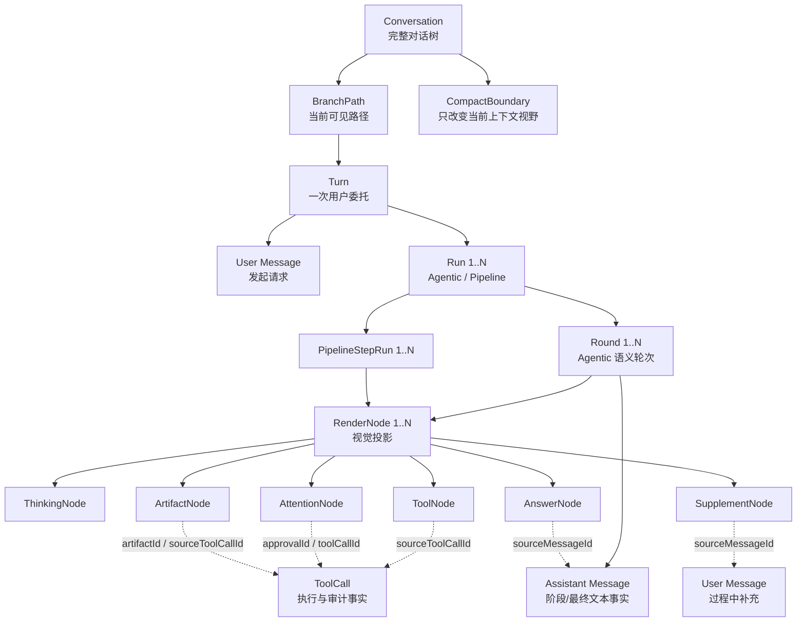
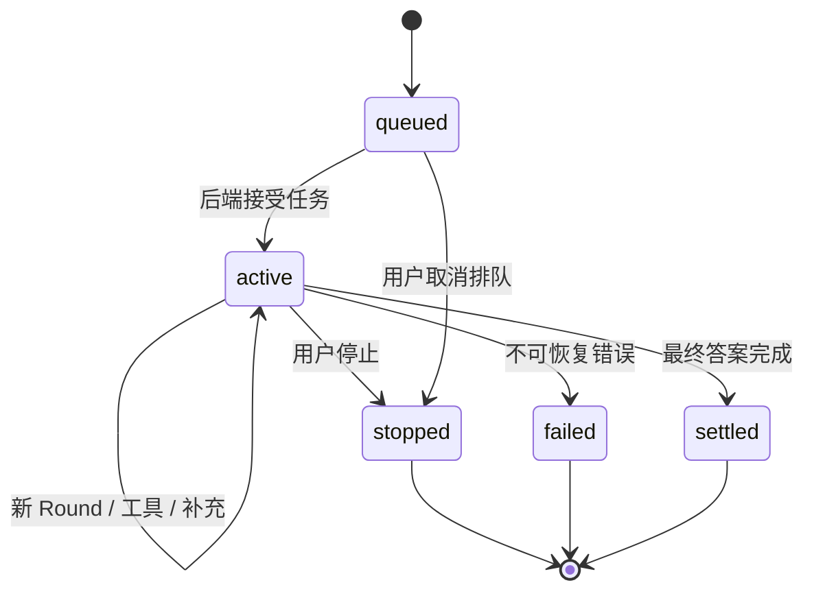
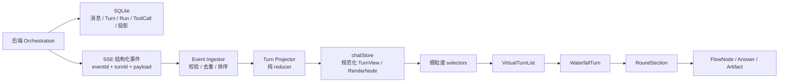
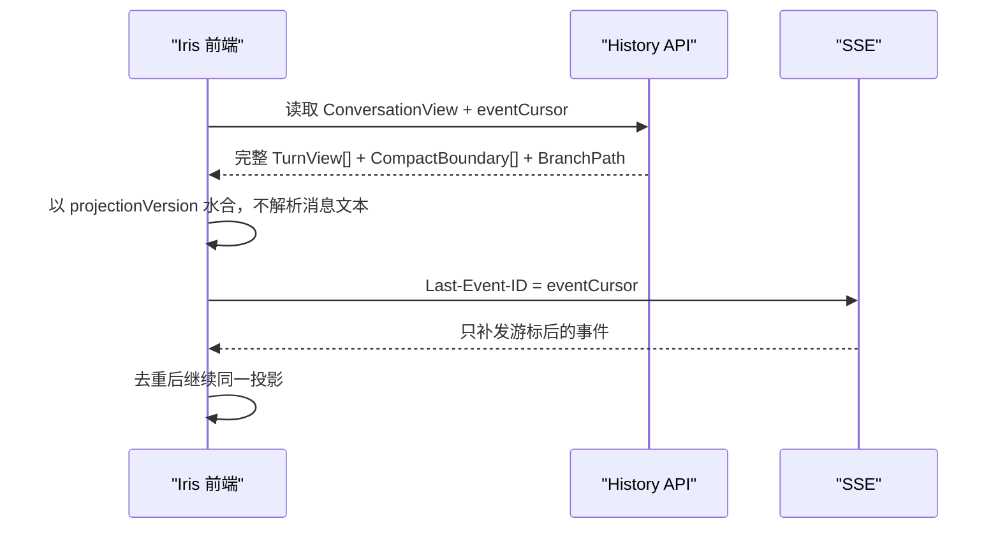
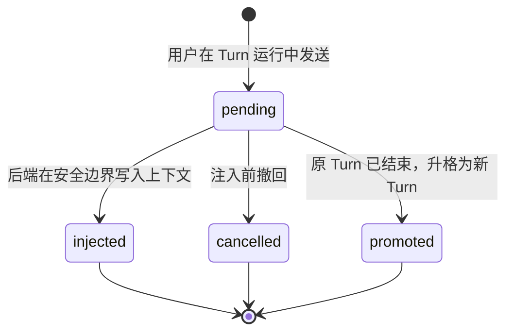
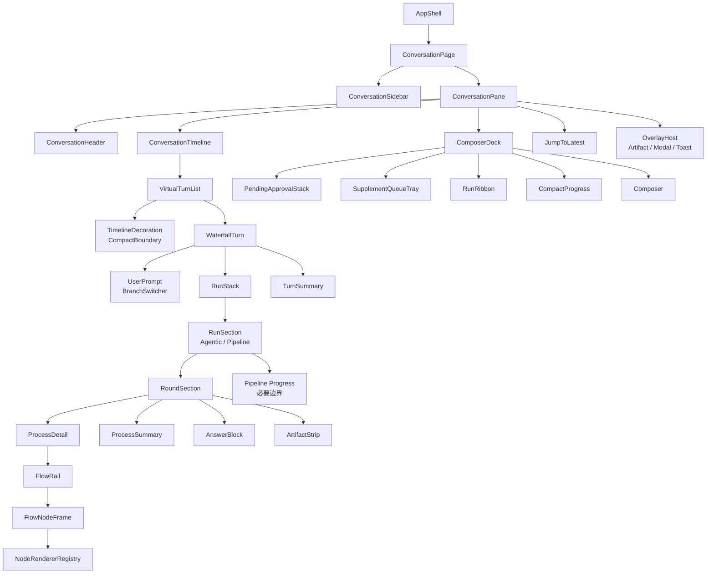

# 07 · 前端架构：瀑布流对话

> 状态：大陆 0 / 节点 0.1 设计稿
>
> 范围：只定义 Iris 前端如何接收、组织和呈现一次长期 Agent 协作，不实现组件。
>
> 参考基线：WonWork SVN r171 的当前前端工作副本；只提炼原理，不复制组件、样式或业务代码。

## 1. 一句话结论

瀑布流对话不是“把聊天气泡换成时间线”，而是把一次用户委托显式建模为：

```text
Turn = 用户请求 + root Run / child Runs + Turn 终态
Agentic Run = N × Round
Pipeline Run = N × Pipeline Step
Round = Agentic 过程 Flow + 阶段答案 Answer
Flow = 思考 / 工具 / 注意力 / 产物 / 补充标记等 RenderNode 的有序投影
```

后端 Agent Loop 产生结构化事件和持久化事实；前端将事件归并为 `TurnView`，组件只读取其中的 `renderNodes`。UI 不解析自然语言，不根据消息排列猜测状态，也不自行重建 Agent 语义。

这套结构解决三个真实问题：

1. 用户先看到结论，需要时才展开过程；
2. 工具、审批、补充和阶段答案之间的因果位置不会丢；
3. 刷新、分支切换、上下文压缩后，画面与历史都能无损恢复。

## 2. 本节点的边界

本节点回答“前端怎样理解并渲染瀑布流”，不提前完成后续大陆的工作：

- 不实现 React 组件、zustand store 或 CSS；
- 不冻结最终 REST/SSE 字段名，正式契约在节点 0.4 更新 `docs/08-api-contract.md`；
- 不决定数据库表结构；
- 不实现 Agent Loop、工具执行、审批后端或分支持久化；
- 不照搬 WonWork 的 `WaterfallTurn`、`FlowNode`、`chatStore` 或渲染内核文件。

本次审计是节点 0.1 的认知基线，不是对 WonWork 前端的穷尽性结论。后续实现 Turn、虚拟列表、流式投影、补充、分支或压缩时，必须带着当时的具体问题重新阅读对应参考源码；如果实现证据推翻本文假设，应先更新本文再改代码。研究与实现是螺旋关系，不是“研究一次、以后只照文档施工”的瀑布关系。

节点 0.4 已在 `docs/02-architecture-overview.md` 与 `docs/08-api-contract.md` 收敛该文档债务：核心 Loop 在后端，Frontend 只提交人的命令并消费 Conversation SSE；0.1 的前端投影设计继续成立。

## 3. 从 WonWork 学到了什么

### 3.1 值得保留的原理

| 原理 | 解决的问题 | Iris 的采用方式 |
|---|---|---|
| `Turn = N × (Flow + Answer)` | 工具与结论被压成一大段后，因果关系消失 | 每次语义模型轮次独立呈现过程和阶段答案 |
| 显式 `renderNodes` | UI 从文本或零散状态猜测过程，容易错乱 | 渲染层只消费带类型、状态和稳定 ID 的节点 |
| 追加事件 → 投影 | 流式更新、重试和恢复难以保持一致 | 用类型化事件 reducer 更新前端投影 |
| 折叠状态只属于用户 | 流式状态变化让内容反复开合，视线跳动 | 流事件永不改写用户展开/收起选择 |
| Turn 级虚拟化 | 长对话持续增长后卡顿 | 虚拟化完整 Turn，不拆散单个 Turn 的语义 |
| 注意力节点独立建模 | 审批、澄清、接管混在普通工具日志里 | 统一为 `AttentionNode`，再投影到就地卡片或浮动条 |
| 压缩线只有位置语义 | “压缩”被误当成删除历史 | 历史不动，时间线只增加一条边界装饰 |
| 分支保存完整尾部结构 | 切回分支后工具详情和轮次丢失 | 分支变体引用完整的消息、工具调用和渲染投影 |
| 人的动作走快路径 | 停止、批准、补充的反馈不能等批量刷新 | 用户动作立即本地回显，后端确认后收敛 |

### 3.2 Iris 不继承的演进包袱

| WonWork 当前做法 | 为什么不适合 Iris |
|---|---|
| 前端持有完整 Agent Loop | 这是“前端需要独立部署”时期的合理选择：Claude Code 的 TypeScript 内核可直接参考，也便于先把产品效果跑出来。独立部署需求后来消失，但职责边界没有随之重构。Iris 已确定核心 Loop 在后端，不再继承这项过期约束 |
| 从 `role === user` 的消息序列分组出 Turn | 补充、命令回执和恢复事件会让推断越来越复杂；Turn 必须是后端显式实体 |
| 一个约 3000 行的 `chatStore` 同时管理模型、文件、WebBridge、审批、分支和 UI | 职责交叉，竞态和循环依赖会随功能增长 |
| `legacyToRenderNodes()` 从旧消息反向猜节点 | 只能做一次性迁移，不能成为长期渲染路径；猜测会丢工具结果和轮次结构 |
| 组件内再次推断 Turn 是否结束、工具是否已完成 | 投影层已经知道这些事实，组件重复推断会产生两个真相 |
| 同一审批同时由独立列表、消息字段和 AttentionNode 表达 | 容易出现批准入口已消失但节点仍等待；Iris 只保留一个审批事实，多种视图只是 selector |
| 通用瀑布组件硬编码业务工具名和产物识别 | 业务渲染应由注册表适配，核心对话层只认识通用节点协议 |
| 为过渡期长期保留新旧两套布局 | Iris 从零设计，只提供显式版本迁移，不把兼容分支留在主渲染树 |
| 先实现复杂 Planner/Scheduler，再寻找必要性 | M0/M1 先用类型化 reducer + 帧级批处理；性能证据出现后再升级 |

核心判断是：WonWork 证明了瀑布流的产品价值，也暴露了“结构后补”会带来的复杂度。Iris 要从第一天就让 Turn、Round、节点、分支和压缩边界成为数据事实。

### 3.3 理解历史，不把历史偶然当成产品本质

WonWork 的前端 Loop 经历了三个阶段：

1. **约束真实存在**：前端需要能够单独部署，模型循环必须随前端运行；
2. **效果优先验证**：Claude Code 的核心实现同属 TypeScript，直接在前端吸收 agentic 能力能最快验证“瀑布流 + 工具执行”的产品效果；
3. **约束消失、结构未迁移**：后端逐渐成为生产级平台，独立前端部署不再必要，但继续重构会延缓功能验证，于是可读性、性能和职责边界被暂时让位给效果。

这条路径说明“先把效果打出来”在探索期有价值，但也说明临时架构必须有退出条件。Iris 当前已经知道最终形态是本地 Windows 产品、Java 后端工具平台、SQLite 持久化和 SSE 单通道，因此没有必要重演同一段迁移。

Iris 的对应策略是：

- **职责提前定清**：Loop、上下文、工具执行、审批真相和持久化在后端；前端只保留投影、交互和临时视图状态；
- **性能提前进入结构**：稳定 ID、规范化状态、Turn 级虚拟化、细粒度 selector、帧级 delta 合并和大产物引用从第一版就存在；
- **实现仍然保持轻量**：不因“考虑性能”就预先实现复杂事件调度器、双车道 DOM 引擎或通用 Graph UI；每一层只在测量证明需要时升级；
- **为临时方案写退出条件**：如果 M0 使用 mock、内存投影或简化 renderer，文档必须写明替换节点和不允许扩散的边界。

提前考虑性能，不是提前做所有性能优化；它是避免选择一种未来只能推倒重来的数据形状。

## 4. 领域模型：消息不是画面，节点也不是消息

### 4.1 八个核心对象

| 对象 | 含义 | 持久化 | 前端是否直接渲染 |
|---|---|---:|---:|
| `Conversation` | 一棵长期对话树及其当前视野 | 是 | 否 |
| `Message` | 模型上下文与历史审计中的原始发言 | 是 | 用户主消息可通过 Turn 头部显示 |
| `Turn` | 一次用户委托，从请求开始到完成/停止/失败 | 是 | 是，虚拟列表最小项 |
| `Run` | 一次可恢复求解过程，类型为 Agentic 或 Pipeline，可形成父子树 | 是 | 只投影用户需要监督的边界 |
| `Round` | Agentic Run 一次“观察→推理→行动/回答”周期 | 是 | 是，Agentic 瀑布段 |
| `PipelineStepRun` | 固定 Pipeline Definition 某一步的运行事实 | 是 | 通常通过 Tool/Run Node 摘要展示 |
| `ToolCall` | 工具请求、参数、审批、执行结果和审计信息 | 是 | 通过对应 `ToolNode` 展示 |
| `RenderNode` | 为稳定呈现而保存的结构化投影 | 是 | 是，渲染唯一输入 |

`Message` 和 `RenderNode` 不能互相替代：

- `Message` 服务于模型上下文、导出、检索和审计；
- `RenderNode` 服务于视觉顺序、流式状态、折叠、产物入口和恢复；
- 一个 assistant message 可能对应多个 Round 的阶段答案；
- 一个工具调用至少有一条 `ToolCall` 事实，但只通过一个稳定的 `ToolNode` 呈现；
- UI 不允许从 `Message.content` 中识别“正在思考”“调用工具”或审批状态。

### 4.2 关系图



### 4.3 `TurnView`：前端真正消费的形状

前端不直接拼接数据库实体，而是消费后端返回的读模型 `TurnView`。字段名在 0.4 冻结，语义先固定如下：

| 字段 | 说明 |
|---|---|
| `turnId` | 全局稳定 ID，虚拟列表 key |
| `branchId` | 所属分支路径 |
| `requestMessageId` | 发起请求的用户消息 |
| `phase` | `queued / active / settled / stopped / failed` |
| `startedAt / endedAt` | 计时事实；前端只用当前时间减 `startedAt` 显示活动耗时 |
| `rootRunId / runIds[]` | 显式 Run 树引用，不从节点推断 |
| `rounds[]` | Agentic Run 的显式轮次顺序，不从消息推断 |
| `renderNodesById` | 当前投影节点表 |
| `stats` | 后端/投影器算出的事实统计，组件不重复计数 |
| `pendingAttentionIds[]` | 当前需要用户处理的注意力节点 |
| `supplements[]` | 补充消息的排队、注入或升格状态 |
| `projectionVersion` | 投影协议版本，用于迁移而不是运行时猜测 |
| `eventCursor` | SSE 断线续传与去重位置 |

`RoundView` 只保存节点引用和已计算统计：

| 字段 | 说明 |
|---|---|
| `roundId / index` | 稳定 ID 与显示序号 |
| `phase` | `active / settled / stopped / failed` |
| `processNodeIds[]` | 本轮过程节点，保持事件顺序 |
| `answerNodeId?` | 本轮零或一个答案节点 |
| `stats` | 本轮思考、工具、错误、耗时等统计 |

### 4.4 RenderNode 联合类型

Iris 的第一版只需要七类节点：

| 类型 | 必要字段 | 视觉职责 |
|---|---|---|
| `thinking` | `id, status, summary, detail?, startedAt, durationMs?` | 呈现可公开的思考摘要或验证过程 |
| `tool` | `id, toolCallId, toolName, status, summary, resultRef?, groupId?` | 呈现工具执行、并行组、重试和错误 |
| `attention` | `id, subtype, status, impact, actions, toolCallId?` | 审批、澄清、授权或人工接管 |
| `artifact` | `id, artifactId, kind, title, sourceToolCallId, previewRef` | 文档、表格、图片、浏览器舞台等产物入口 |
| `answer` | `id, status, content, role=stage|final, sourceMessageId` | 阶段结论或最终答案 |
| `supplement` | `id, status, text, sourceMessageId, injectedAfterRoundId?` | 保留准确因果位置，但按普通用户追加消息呈现 |
| `run` | `id, childRunId, kind, status, progressSummary` | 在需要监督时呈现 Pipeline/child Run 的整体进度 |

`ToolNode.summary` 是折叠状态也可见的一句话结论；`evidenceSummary` 只在它提供不同的
验证信息时存在。投影与组件都应去重，不能把同一句 Runtime message 连续渲染两遍。

所有节点共享：

- 稳定 `id`，刷新、重连和分支切换后不变；
- 显式 `status`，不从文案、CSS class 或相邻节点推断；
- 可选 `groupId`，用于并行或重试组；
- `runId`，并按需要带 `roundId` 或 `pipelineStepRunId`；
- `source*Id`，允许从视觉追溯到消息、工具调用和产物；
- 小而安全的展示数据；大结果只保存引用，不把 blob 塞进对话状态。

## 5. Run、Round 和 Turn 的准确语义

### 5.1 什么算一个 Round

一个 Round 是一次语义模型周期：

1. 模型读取当前上下文；
2. 产生思考摘要、阶段文本或工具请求；
3. 如有工具，等待工具结果并结束本 Round；
4. 工具结果回注后再次调用模型，进入下一 Round。

以下情况不创建新 Round：

- SSE 断线后从游标续传；
- 同一回答因输出长度继续传输；
- 传输层重试但语义调用未重启；
- UI 重新水合或切回当前分支。

重试若作废了一次语义调用，后端应在持久化事实中标记 attempt；默认 UI 将失败 attempt 折叠在本 Round 的重试组中，而不是伪装成一个新 Round。

Pipeline Step 不是 Round：它可以是确定性变换、Tool、人工 gate、Pipeline child Run 或受限 Agentic child Run。前端只根据持久化 RenderNode 展示用户需要监督的步骤，不为 Pipeline 自行运行编排器。

### 5.2 Turn 状态机



审批等待不是 Turn 的独占 phase。一个 Turn 可能一边等待审批，一边完成并行的只读工作；等待事实属于 `AttentionNode.status`，`TurnView.pendingAttentionIds` 只是索引。运行缎带可据此显示“等待 1 项确认”，但不能把整个 Turn 强行改写成单一 `awaiting_approval`。

### 5.3 Round 在屏幕上的形状

```text
用户请求

第 1 轮 · 思考 2.4s · 调用 2 个工具 · 共 5s   [展开]
阶段结论 · 第 1 轮
……

第 2 轮 · 调用 1 个工具 · 共 3s               [展开]
阶段结论 · 第 2 轮
……

第 3 轮 · 思考 1.1s                            [展开]
最终答案
……

共 3 轮 · 调用 3 个工具 · 总耗时 9s
```

过程摘要始终来自结构化统计。展开后才显示本轮的思考、工具、审批历史和补充标记。阶段答案保持可见，因为它是用户理解 Agent 改变判断的关键证据；最后一个完成的 Answer 才是最终答案。

## 6. 从事件到画面的单向数据流

### 6.1 实时路径



事件进入前端后遵循五步：

1. 使用 `eventId + turnId` 去重，旧游标事件直接忽略；
2. 校验事件类型和投影版本，未知事件记录为可见错误而非静默吞掉；
3. reducer 只更新目标 Turn、Round 或节点；
4. zustand 通过细粒度 selector 只通知受影响组件；
5. React 渲染投影，不执行 Agent 决策。

高频 answer delta 从第一版起就在一次 animation frame 内合并，停止、批准、拒绝、补充等人的动作直接走快路径。M0/M1 不引入复杂双车道 Scheduler；只有性能测量证明 reducer 批处理不足时才升级。这样性能约束已经进入结构，却没有把原型阶段变成渲染引擎研发。

数据到达与视觉呈现之间还有一层速率自适应的视觉时钟（揭示引擎），流式正文的三段呈现、完成提升与失效退场见 [24 · 丝滑交互体验引擎](24-silky-interaction.md) §2–§3。

### 6.2 刷新与重连路径



如果投影版本过旧，由后端迁移或返回明确的迁移结果。前端不维护永久性的 `legacyToRenderNodes()` 猜测通道。开发期允许清空无价值的演示数据，生产数据则必须走显式迁移。

### 6.3 三个真相层级

1. **持久化事实**：Message、Turn、Run、Round/PipelineStepRun、ToolCall、分支、压缩边界和事件；
2. **持久化读模型**：`TurnView + renderNodes`，保证精确恢复和低成本首屏；
3. **临时视图状态**：展开、滚动、选中、模态框和草稿。

DOM 从来不是真相。CSS class 不能反向决定节点状态，组件本地 timer 也不能宣布工具已经完成。

## 7. 瀑布流渲染算法

### 7.1 列表层

`ConversationTimeline` 接收后端已排序的 `turnIds[]`：

- 以完整 Turn 为虚拟列表项，稳定 key 为 `turnId`；
- 压缩线是 Turn 之间的 `TimelineDecoration`，不伪装成消息；
- 只渲染当前分支路径，其他分支仍在持久层；
- assistant-only 的系统回执必须有明确的 `SystemTurn`/`TimelineEvent` 类型，不能靠缺少 user message 兜底。

向上翻页（历史窗口）：

- 首屏只取最近一页（`limit=50`），`hasEarlierTurns=true` 时列表顶部存在"更早"；
- 触顶（Virtuoso `startReached`）即以当前视野最早 Turn 为 `beforeTurnId` 拉上一页，实体并入本地投影——本地较新版本优先，历史页只补不覆盖；
- 预插用 Virtuoso `firstItemIndex` 负偏移锚定视口：翻页发生时用户正在读的位置一个像素都不动；
- 顶端的加载提示是悬浮的一行低对比 caption，不进列表布局（占位会打破锚定），不闪烁、无骨架屏；拉到最早后该入口安静消失；
- 历史不可丢（不变量 1）在此的用户可感形态：任何长度的对话都能一路滚回第一轮。

### 7.2 Turn 层

`WaterfallTurn` 只做编排：

1. 渲染用户请求；
2. 按 `runIds` 渲染 `RunSection`；Agentic Run 内再按 `roundIds` 渲染 `RoundSection`；
3. 渲染 Turn 级产物和总结；
4. 渲染分支切换入口与终态信息。

它不负责：

- 合并消息猜 Round；
- 计算 Turn 是否结束；
- 执行审批；
- 解析工具结果识别业务类型；
- 创建 DOM toast；
- 维护后端事实的副本。

### 7.3 Round 层

每个 `RoundSection` 固定为：

```text
ProcessDetail（可选，展开时存在）
ProcessSummary（固定锚点）
AttentionInline（仅需就地解释时）
AnswerBlock（阶段/最终）
ArtifactStrip（本轮产物，可选）
```

摘要行放在过程详情下方：用户点开时，内容从点击位置上方向外展开，摘要锚点向下移动，眼睛不必重新寻找入口。

折叠状态规则：

- 初始默认折叠，错误和待处理 Attention 由独立可见入口提醒；
- 只有用户点击修改 `expandedRoundIds` / `expandedNodeIds`；
- token delta、节点完成、Round 切换、Turn 结束均不得重置；
- 状态保存在 `viewStateStore`，虚拟列表卸载再挂载也不丢；
- “全部展开”只是批量修改用户视图状态，不改业务数据。

### 7.4 FlowNode 层

`FlowNode` 根据 `node.type` 分派到注册渲染器：

```text
FlowNodeFrame
├── StatusRail / Icon
├── NodeHeader（标题、状态、耗时、展开）
└── NodeBodyRendererRegistry[type or rendererKey]
```

核心组件只处理通用状态；工具特有结果通过 `rendererKey` 注册：

- 未注册工具使用统一摘要、参数和结果引用；
- 表格、文件、浏览器舞台等由独立 renderer 展示；
- renderer 只能读取安全投影，不能执行工具或改变审批事实；
- 大结果按需读取，不随每次 token delta 重渲染。

## 8. 五类关键交互的职责边界

### 8.1 过程中补充

补充在等待期是独立持久化事实；注入时才成为普通 User Message。它不创建新 Turn，
但在视觉和模型语义上都与用户最初提问同层。



视觉表达：

- `pending`：composer 上方出现“待送入”chip，可撤回；
- `injected`：chip 原位确认后淡出，同时在准确 Round 边界出现普通用户消息气泡；
- `promoted`：chip 变成排队的新 Turn，不伪称已经注入；
- 停止当前 Turn 时，尚未注入的文本必须保留给用户处理，绝不自动再次执行。

补充的注入边界由后端 Loop 决定并回传 `injectedAfterRoundId`。前端不能因为“工具节点看起来完成了”就自行宣布注入成功。

### 8.2 分支

编辑并重发不会覆盖旧消息，而是创建新分支：

- 用户消息旁显示轻量 `‹ 2/3 ›` 切换；
- 切换分支先停止活动 Turn，再加载目标 `BranchPath`；
- 分支变体保存完整尾部引用，包含 Round、ToolCall、renderNodes 和检查点；
- 前端只切换当前视野，绝不删除非活动分支；
- 文件世界回滚属于后端/工作区事务，前端只展示结果。

Iris 不在前端保存整条深拷贝尾巴作为长期真相。服务端返回目标分支视图，前端用 ID 归一化缓存。

### 8.3 压缩线

压缩只改变模型“当前看见什么”，不改变用户历史：

- `CompactBoundary` 是 Conversation 级实体；
- 时间线在切点绘制细分隔线：“此前 42 条已摘要为背景”；
- 用户可打开摘要，但原消息仍可查看、搜索和分支；
- 分支点决定哪条压缩线适用，前端只展示后端给出的当前路径结果；
- 压缩进行中由 composer 上方 2px 细轨道表达，不插入假消息。

### 8.4 审批条

审批事实只有 `AttentionNode` 一份，界面有两个投影视角：

1. Round 内的就地卡片：保留上下文、影响陈述和最终决定；
2. composer 上方的 `PendingApprovalStack`：让当前待办不被滚走。

二者共享同一 `attentionId` 和 selector，不维护两套状态。浮动条的职责是“减少寻找”，不是复制完整详情：

- 整条主操作为批准，拒绝是清晰的次操作；
- 显示工具名、风险点和一句人话影响；
- 决定后先原地淡化，再收拢高度；
- 多条审批按出现顺序稳定排列，新项靠近 composer；
- 任何批准/拒绝先产生本地 `submitting` 反馈，最终状态以后端事件为准。

ghost 两阶段退场、稳定槽位、防重与 `Tab` 快速批准首项的完整机制见 [24](24-silky-interaction.md) §7。

### 8.5 文件与产物卡片

`ArtifactNode` 只描述产物身份、来源和预览引用：

- `ArtifactCard` 负责预览、打开、下载、定位来源；
- 生成、修改、删除产物仍是工具行为，卡片不能绕过审批；
- 文件卡不读取任意本地路径，只消费工作区服务签发的围栏内引用；
- 同一 `artifactId` 的新版本递增，不覆盖旧版本；
- 工具详情保留“已提升为产物”的链接，避免结果重复展示。

### 8.6 运行缎带

`RunRibbon` 是 Turn 的状态摘要，不是第二个控制面板：

- 显示当前阶段、总耗时、运行工具数、排队补充数、待审批数；
- 停止按钮只在 composer 保留一处；
- 缎带不承担审批操作；
- 计数和 `startedAt` 来自 `TurnView`，不在组件内部重置业务计时；
- Turn 结束后自然卸载，不在历史中留下重复状态行。

## 9. 组件层次



### 9.1 组件职责清单

| 组件 | 只负责 | 明确不负责 |
|---|---|---|
| `VirtualTurnList` | 虚拟化、滚动跟随、回到最新 | 分组消息、计算 Turn 状态 |
| `WaterfallTurn` | 组合用户请求、Run、产物、总结 | 解析消息、调用 API |
| `RunSection` | 按 Run kind 组合 Agentic Round 或 Pipeline 进度节点 | 执行 Pipeline 或决定 child Run |
| `RoundSection` | 过程折叠、阶段/最终答案排布 | 计算 Round 事实 |
| `FlowNodeFrame` | 通用外壳、状态和可访问性 | 业务工具结果识别 |
| `NodeRendererRegistry` | 按类型/rendererKey 选择安全 renderer | 工具执行 |
| `PendingApprovalStack` | 当前审批的近端入口 | 持有独立审批真相 |
| `ComposerDock` | 输入、附件、停止、运行期补充入口 | Agent Loop |
| `OverlayHost` | 统一焦点、Esc、滚动锁和层级 | 业务状态 |

## 10. 状态层划分

沿用项目约束中的三类 zustand store，但缩小职责。

### 10.1 `chatStore`

保存当前对话读模型和实时投影：

- `turnsById / turnOrder`;
- `runsById`;
- `renderNodesById`;
- `roundsById`;
- `pendingAttentionIds`;
- `streamCursor / connectionState`;
- 事件 ingestion 与纯 reducer action。

不保存 provider 密钥，不执行 Agent Loop，不操作文件，不直接创建 toast。

### 10.2 `conversationStore`

保存导航与长期视野：

- 会话列表、当前 conversationId；
- 当前 branchId 与可用分支摘要；
- compact boundaries；
- 加载、切换、重命名等 API 状态。

完整历史仍在后端；store 只是当前工作集缓存。
会话列表中的 `activeTurnCount` 也是 SSE 投影：`turn.accepted / turn.updated` 必须按
Turn 进入或离开 `queued / active` 的状态差增量更新，不能等下一次整页加载才纠正。
该摘要只用于导航反馈，不反向决定 Turn 是否仍在运行。

### 10.3 `viewStateStore`

只保存可丢弃或可重建的用户视图偏好：

- `expandedRoundIds / expandedNodeIds`;
- `followMode / atBottom / unseenTurnCount`;
- 主题、列宽、面板开关；
- 当前 artifact/modal；
- 草稿与选择引用。

它不得 import API client 或其他 store 的实现，避免循环依赖。持久化采用小粒度、带版本的防抖写入。

### 10.4 状态依赖方向

```text
API / SSE → chatStore | conversationStore
chatStore + conversationStore → selectors → components
viewStateStore → components
components → typed actions → API / store
```

禁止：

```text
component A 改 DOM → component B 读 DOM 猜状态
viewStateStore → import chatStore → import API → import viewStateStore
消息文本 → 正则 → 工具/审批/完成状态
```

## 11. 滚动、流式与性能

### 11.1 滚动跟随状态机

只有两个用户可理解的模式：

- `following`：用户在底部，新内容保持可见；
- `reviewing`：用户主动离开底部，任何流式内容都不能抢回视口。

切换规则：

- 底部哨兵进入容差区 → `following`；
- wheel、touch、键盘或拖动让用户离开底部 → `reviewing`；
- reviewing 期间只累计“新增 N 轮”，不按 token 跳数字；
- 点击“回到最新”才平滑恢复；
- 展开历史 Round 时保持点击锚点，不能把视口拉到底。

意图识别只信原生输入事件（程序化滚动永不误判），完整状态机与容差参数见 [24](24-silky-interaction.md) §4。

### 11.2 渲染粒度

- Turn 级虚拟化，防止一个语义单元被拆散；
- `WaterfallTurn`、`RoundSection`、`FlowNode` 使用稳定 ID 和 selector；
- answer delta 每帧最多提交一次；
- Markdown 在流式时使用容错文本呈现，settled 后再做完整解析；
- 大产物懒加载，历史 Turn 可使用 `content-visibility`；
- 运行计时使用共享 ticker，不为每个节点创建 interval；
- `prefers-reduced-motion` 下所有揭示动画即时完成。

### 11.3 性能门槛

节点 1.2 实现时至少验证：

- 1000 个已完成 Turn 的滚动无明显卡顿；
- 单个活跃 Turn 每秒 20 次 delta 时输入仍可响应；
- 展开历史 Round 不改变可见锚点；
- 切换分支后无旧节点闪现；
- 审批条决定后的两阶段退场不造成列表跳动。

## 12. 哪些设计是功能，哪些只是风格

### 12.1 功能性设计，不应随换肤改变

| 设计 | 功能价值 |
|---|---|
| Turn / Round 明确分层 | 保留工具与阶段结论的因果关系 |
| 过程摘要 + 手动展开 | 同时降低噪音和保留可审计性 |
| 稳定折叠状态 | 避免视线被流式更新拖走 |
| composer 近端审批 | 减少寻找当前阻塞点 |
| 审批两阶段退场 | 让用户看见决定已生效且布局不突跳 |
| 补充 chip + 定位后的用户气泡 | 确认消息被接住，又不制造假 Turn |
| 压缩线 | 让“当前上下文变了、历史没丢”可见 |
| 分支计数器 | 明确当前位置和其他变体仍存在 |
| 回到最新胶囊 | 尊重用户翻阅历史的意图 |
| 错误/等待状态显式 | 失败不沉默，阻塞点可定位 |

### 12.2 可替换的风格偏好

以下内容可以在节点 1.1 设计令牌阶段重新设计，不影响架构：

- 彩虹或单色强调色；
- 脊柱是线、点、图标还是弱分隔；
- 圆角、阴影、玻璃模糊和留白尺度；
- 阶段结论 chip 的具体外观；
- 回答是逐字、逐块还是淡入；
- 字体、字号、明暗主题；
- 产物卡是横向条、网格还是抽屉；
- 动画曲线和时长。

Iris 的品牌约束仍是“像雨后彩虹，不是霓虹灯”。彩虹只用于身份与注意力锚定，不能让每个节点都争抢视觉中心。

## 13. 可访问性与安全

- 摘要行、节点头、审批动作都使用原生 button；
- `aria-expanded` 与 `aria-controls` 对应真实展开区域；
- 关键状态通过单一 `aria-live="polite"` announcer 节流播报；
- 浮层统一焦点陷阱，关闭后归还触发点；
- 审批不能只靠颜色表达风险；
- 流式内容不逐 token 播报，Round 完成后再播报摘要；
- Markdown 和工具结果按不可信输入处理；
- 任意 HTML 产物只能进入隔离 iframe；
- 文件卡只接收围栏内 artifact reference，不接受任意系统路径；
- UI 中的“批准”只发送决策，真正写操作仍由后端 ApprovalGate 执行。

## 14. 建议文件边界（实现阶段）

这是职责草图，不要求逐字采用文件名：

```text
frontend/src/
├── domain/chat/
│   ├── models.ts              # TurnView / RunView / RoundView / RenderNode
│   ├── events.ts              # 类型化前端事件
│   ├── projector.ts           # 纯 reducer
│   └── selectors.ts
├── api/
│   ├── conversationClient.ts
│   └── chatEventStream.ts
├── stores/
│   ├── chatStore.ts
│   ├── conversationStore.ts
│   └── viewStateStore.ts
├── components/chat/
│   ├── ConversationTimeline.tsx
│   ├── WaterfallTurn.tsx
│   ├── RunSection.tsx
│   ├── RoundSection.tsx
│   ├── ProcessSummary.tsx
│   ├── FlowNodeFrame.tsx
│   ├── AnswerBlock.tsx
│   ├── PendingApprovalStack.tsx
│   ├── SupplementQueueTray.tsx
│   ├── CompactBoundary.tsx
│   └── ComposerDock.tsx
└── renderers/
    ├── registry.ts
    ├── tool/
    └── artifact/
```

相比 WonWork，这个拆分刻意删除：

- 前端 `agenticLoop.ts`；
- 旧消息推断器；
- 新旧两套 Waterfall 布局；
- 通用组件中的业务工具名判断；
- 巨型全能 store。

## 15. 最小实现顺序

后续大陆 1 可按以下顺序落地：

1. 定义设计令牌和基础组件；
2. 用静态 `TurnView[]` 实现 Turn / Run / Round / RenderNode；
3. 加入手动折叠和 Turn 级虚拟列表；
4. 实现滚动跟随与回到最新；
5. 实现 ComposerDock、补充 tray 和审批浮动投影；
6. 加入主题与响应式；
7. 大陆 2 再接真实 SSE reducer，替换静态事件源。

静态数据必须覆盖真实结构：Agentic root Run、Pipeline child Run、多 Round、并行工具、失败、待审批、补充、分支和压缩线。不要只做“一问一答”的漂亮 demo。

## 16. 节点 0.1 验收场景

实现者读完本文，应能准确回答：

1. 为什么 Message、ToolCall 和 RenderNode 是三个对象？
2. 为什么 Turn 必须由后端显式给出，不能按 user message 分组？
3. 为什么 Turn 下需要 Run；为什么 Agentic 有 Round，而 Pipeline 有 Step？
4. 为什么 renderNodes 是 UI 的唯一输入，但不是唯一持久化事实？
5. 补充消息如何既不丢失，又不冒充新 Turn？
6. 分支和压缩线为什么都是“改变当前视野，不删除历史”？
7. 审批条和 Round 内审批卡为什么可以共存却只能有一个状态源？
8. 哪些视觉行为解决了寻找与跳动问题，哪些只是品牌风格？

### 16.1 数据流验收

给定以下事件：

```text
turn.started
run.started(agentic)
round.started(1)
thinking.started / completed
tool.started(search_train) / completed
answer.delta("已找到三个班次") / completed(stage)
round.completed(1)
run.started(pipeline,parent=agentic)
run.settled(pipeline)
round.started(2)
supplement.queued("优先靠窗")
supplement.injected(afterRound=1)
attention.requested(book_ticket)
attention.resolved(approved)
tool.completed(book_ticket)
answer.completed(final)
run.settled(agentic)
turn.completed
```

任何实现者都应画出：

- 一个 Turn；
- 一个 root Agentic Run 和一个 child Pipeline Run；
- 两个 Round；
- 第一轮一个阶段结论；
- 第二轮一个轻量补充标记、一个审批节点、一个最终答案；
- composer 上方审批条在决定后原地淡化再收拢；
- 所有过程默认折叠，但历史与来源完整可展开。

## 17. 参考审计记录

本设计实际阅读并交叉验证了 WonWork SVN r171 当前工作副本中的：

- `src/types/chat.ts`
- `src/agent/renderNodeBuilder.ts`
- `src/agent/renderKernel/renderEvent.ts`
- `src/agent/renderKernel/eventLog.ts`
- `src/agent/renderKernel/turnProjector.ts`
- `src/agent/renderKernel/projectedBuilder.ts`
- `src/components/Chat/MessageList.tsx`
- `src/components/Chat/WaterfallTurn.tsx`
- `src/components/Chat/FlowNode.tsx`
- `src/components/Chat/ComposerTray.tsx`
- `src/components/Chat/ComposerRibbon.tsx`
- `src/components/Chat/CompactBar.tsx`
- `src/components/Chat/InputArea.tsx`
- `src/stores/chatStore.ts` 中分支、压缩、补充与审批相关路径
- `learn/03/strategy/wonwork-render-kernel-design-v2.0.md`
- `learn/03/strategy/wonwork-轮次瀑布蓝图-v4.0.md`

审计只用于提炼问题、约束和职责边界。本文的数据模型、组件层次、后端 Loop 边界、store 拆分与实现顺序均面向 Iris 重新设计。

## 18. 外壳层：侧栏、搜索、设置与层栈

对话区之外的壳（Shell）同样遵守"发现优于塞满"与"视觉克制"。外壳的职责是
**减少寻找**，不是展示功能密度。

### 18.1 侧栏：会话管理

侧栏是会话的目录，不是第二个工作区：

- 选中项用 accent 左条（`scaleY` 生长）标位，不整行换底色之外的强调；
- 列表上下边缘在可滚动时给出渐变淡化，提示"还有"，不加边框；
- 重命名是行内编辑（菜单或双击进入，Enter 收敛、Esc 放弃、blur 收敛），
  接 `PATCH /conversations/{id}`，乐观更新但以后端 `conversation.updated` 为准；
- 归档从列表收起（`POST /conversations/{id}/archive`），历史完整保留；
  归档当前会话前先切到相邻会话或空态，不在原地留下尸体；
- 底部常驻"设置"入口块——设置是覆盖层，不是导航目的地（见 §18.3）；
- 折叠为窄 rail 时只保留：新建、搜索、当前会话指示、设置。会话标题属于
  展开态，rail 不用 tooltip 复述整个列表。

### 18.2 搜索浮层（Ctrl+K）

- 居中偏上的浮层，背景轻虚化；搜索范围是已加载会话的标题与最近预览；
- 全键盘可达：↑↓ 移动、Enter 跳转、Esc 关闭；鼠标只是备用通道；
- 无结果时给出一句静的状态，不弹错误。

### 18.3 设置覆盖层

- 设置是全屏覆盖层，对话基座不卸载——回到对话时流式、滚动位、草稿原样存续；
- 只放真正的偏好：主题（亮/暗/跟随系统）、色调、动效（减弱开关）、
  默认权限模式；不放任务数据；
- 修改即生效并持久化（localStorage），不需要"保存"按钮。

### 18.4 Esc 层栈

任一时刻可有多个浮层（移动侧栏、搜索、设置、能力中心、Modal）。规则只有一条：
**Esc 关闭最上层**。每层在打开时注册自己，关闭时注销；层栈是全局唯一事实，
各层不互相探测对方状态。对话框类组件（Radix）内部已消费 Esc，不重复入栈。

