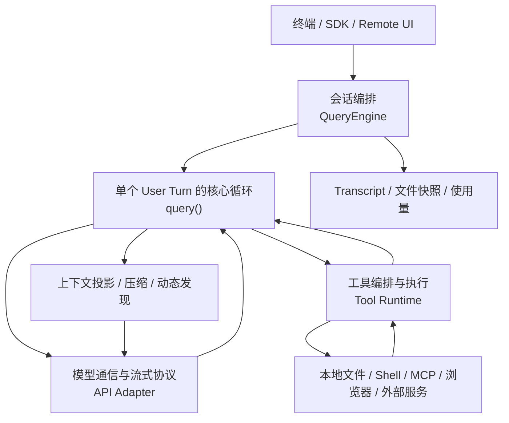
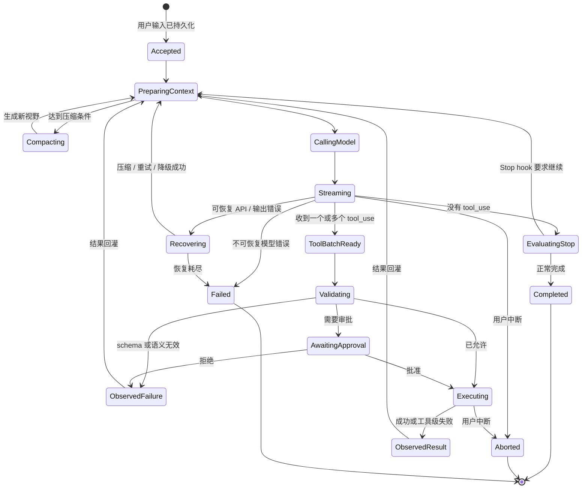
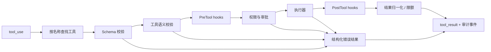
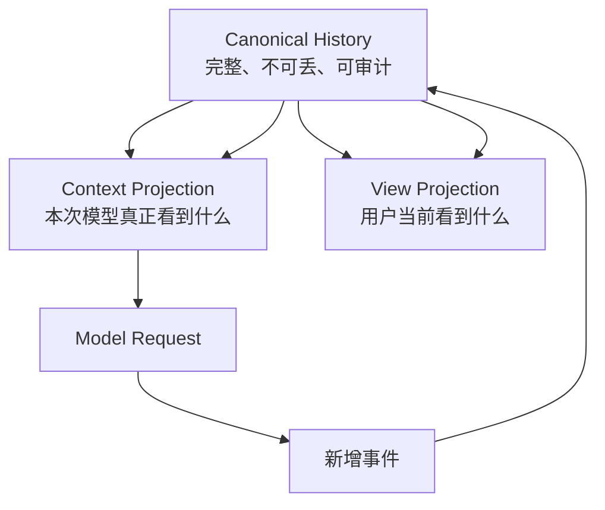
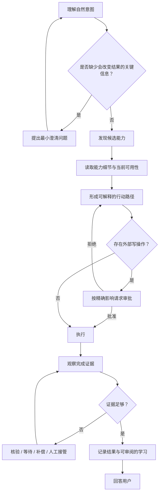

# 12 · Agentic 内核研究：从代码智能体到生活能力平台

> 状态：大陆 0 / 节点 0.2 研究稿
>
> 范围：研究 Claude Code 如何组织模型循环、工具执行、上下文、恢复与本地桥接，并判断哪些原理适合 Iris。本文不实现产品代码，也不冻结节点 0.4 的最终接口。
>
> 本地源码基线：`E:\IntelliJ IDEA\Project\claude-code`，Git commit `4e4111be928719ad4728fd38aa160582f1597a71`。

## 1. 先说结论

Claude Code 最值得 Iris 学习的，不是终端 UI、代码编辑能力或工具数量，而是把模型与真实环境之间的往返做成一套**可恢复的协议**：

```text
接收并持久化用户输入
→ 构造本轮模型视野
→ 流式调用模型
→ 收集结构化 tool_use
→ 校验、审批并执行工具
→ 把 tool_result 持久化为新观察
→ 再次构造视野并调用模型
→ 直到得到终态
```

它表面上是一个 `while (true)`，骨子里却有四层纪律：

1. **历史事实与当前上下文分离**：磁盘 transcript 保存会话事实，模型只看到经过边界、裁剪和压缩后的当前视野；
2. **模型决定意图，运行时决定能否执行**：模型产生结构化调用，但 schema、语义校验、权限、钩子和执行器共同决定结果；
3. **失败也回到循环**：参数错误、权限拒绝、工具失败和部分可恢复的 API 错误都会变成模型可观察的结构化结果；
4. **任何半成品都要闭合协议**：中断、流式降级或异常时，也要补齐 `tool_use ↔ tool_result` 配对，避免历史不可回放。

Iris 应采用这种通用内核，但不能把 Claude Code 的“代码仓库 + 文件 + Shell”世界直接放大成生活助手。代码世界的对象、动作和验证信号相对规整；日常生活的意图更模糊、对象更分散、约束更隐含、外部副作用更难撤销。Iris 真正长期困难的是：

> 如何把生活中的自然表达，转成模型能发现、理解、组合、审批、观察和演进的能力。

所以，工具注册表和能力目录只是起点。Iris 还需要继续探索能力描述、情境约束、观察证据、补偿动作、轻量 DIY 接入和个人知识之间的关系。

## 2. 证据边界

### 2.1 本地仓库不是官方源码发布

本地 `claude-code` 仓库的 `AGENTS.md` 和 `package.json` 明确说明它是反编译、逆向恢复并继续修复的版本，其中还包含实验特性、内部开关、恢复代码和仓库维护者新增的文档。因此本文采用三档证据：

| 标记 | 含义 | 使用方式 |
|---|---|---|
| **源码事实** | 在本地 commit 的实际调用链中可直接观察 | 可以据此解释该基线的机制 |
| **公开事实** | Claude Code 官方公开文档描述的用户可见行为 | 用于校验源码研究没有偏离产品外显语义 |
| **Iris 推断** | 根据证据做出的设计判断 | 不是 Claude Code 的官方设计说明 |

内部注释中出现的实验阈值、统计数字和功能开关，只用于理解“它在解决哪类问题”，不作为 Iris 的固定参数。

### 2.2 一次研究不是最终答案

Claude Code 的本地基线包含三千多个文件，核心 `query.ts`、API 层、工具层、权限层、上下文压缩和 bridge 又各自形成子系统。节点 0.2 只能建立第一版结构地图。

以后实现以下模块时，必须重新做问题驱动的纵向阅读：

- Agent Loop 与中断恢复；
- 工具发现、稳定代理与真实能力解析；
- 文件读写一致性和路径围栏；
- 审批挂起与恢复；
- transcript、分支和 compact 边界；
- API 重试、幂等和模型降级；
- WebBridge、本地 daemon 与远程控制。

若后续证据推翻本文，应先修改本文，再修改代码。

## 3. 先统一术语

“轮次”在不同层里容易混淆。本文采用三层术语：

| 术语 | 定义 | 示例 |
|---|---|---|
| `User Turn` | 用户提交一次委托到系统返回终态 | “整理这些报销材料”到最终答复 |
| `Model Step` | 一次模型请求及其流式响应 | 模型读取目录后决定再读取三个文件 |
| `Tool Call` | 一个结构化工具请求及其结果 | `read_file` 与对应内容 |

一个 `User Turn` 可以包含多个 `Model Step`，一个 `Model Step` 可以产生多个 `Tool Call`。

这与前端文档中的关系一致：

```text
Turn = 用户委托 + N × Round + 终态
Round ≈ 一个 Model Step 及其工具观察
```

前端的 `Round` 是展示和持久化语义，后端的 `Model Step` 是运行语义；节点 0.4 再决定是否使用同一个 ID，不在本节点提前冻结。

## 4. Claude Code 的分层

源码主链路可以抽象为五层：



| 层 | 主要职责 | 不是它的职责 |
|---|---|---|
| 交互层 | 收集输入、显示事件、承载审批 | 不自行执行工具 |
| 会话编排层 | 跨 User Turn 保存消息、成本、快照、恢复信息 | 不决定单个工具的安全语义 |
| 核心循环层 | 组织 Model Step、工具回灌、终止与恢复 | 不实现具体文件或网络动作 |
| 工具运行时 | 查找、校验、审批、并发、执行、结果映射 | 不决定产品对话布局 |
| 通信层 | provider 请求、流事件解析、重试与降级 | 不持有完整产品历史真相 |

Iris 的核心 Loop 已确定放在 Java 后端。前端只消费 SSE 事件并维护视图投影；这不是照搬 Claude Code 的进程结构，而是保留其职责分离。

## 5. 一次完整调用周期

### 5.1 User Turn 开始前先落盘

`QueryEngine.submitMessage()` 先处理用户输入和附件，把新消息加入会话，再在进入模型循环前写 transcript。

这个顺序解决了一个容易被忽略的问题：用户刚点击发送、API 还没返回时，进程可能被停止。如果只在收到 assistant 消息后才记录，用户已经发出的委托会从恢复入口消失。

Iris 应把它提升为硬不变量：

> 后端接受 Turn 的成功响应，只能发生在用户输入和 Turn 起点已经持久化之后。

前端的乐观显示不等于后端已经接受；SSE 必须给出稳定 `turnId` 和接受事件。

### 5.2 每个 Model Step 都重新构造当前视野

核心循环不是把原始消息数组原封不动发送给模型，而是依次执行：

1. 取 compact 边界之后的当前段；
2. 对过大的工具结果应用预算；
3. 可选地清理旧工具结果；
4. 应用局部上下文折叠；
5. 检查并执行自动压缩；
6. 拼接稳定系统提示、系统环境和用户上下文；
7. 根据本轮权限、模型和发现状态重新生成工具集合。

这说明上下文管理不是 Loop 外的一次性准备，而是每个 Model Step 的前置阶段。

### 5.3 模型流式输出被拆成事件和事实

通信层一边转发原始流事件，一边在 `content_block_stop` 时构造可持久化 assistant 消息。完成后的 `message_delta` 再补上真实 usage 和 stop reason。

核心循环不依赖 `stop_reason === tool_use` 判断是否继续，而是实际扫描 assistant 内容中是否出现 `tool_use` block。每个 block 都带稳定 `tool_use_id`，之后的结果必须引用它。

### 5.4 工具可以在模型流还没结束时启动

当流式工具执行开启时，运行时在一个完整 `tool_use` block 到达后就能开始执行，不必等待整个 assistant 响应结束。

但并发不是“所有工具一起跑”：

- 工具先解析输入；
- 每个工具声明当前输入是否 concurrency-safe；
- 只有连续的安全调用可以并行；
- 非并发安全调用形成屏障；
- 产生上下文修改器的写操作按顺序应用。

Iris 可以采用“显式安全并发 + 默认串行”，但第一版不需要流式抢跑。正确性、审批恢复和事件顺序先稳定，再用指标证明是否值得提前执行。

并发安全也不能永久停留在一个 `readOnly: boolean`。两个只读调用通常可以并行，但两个写入不同资源的动作也可能安全，两个表面只读、实际争用同一浏览器会话的动作却未必安全。Iris 后续应让执行器给出资源占用声明，例如：

```text
reads:  [workspace:/reports/**]
writes: [browser-session:personal, external-order:merchant-x]
```

调度器按资源冲突、风险和依赖关系分组；声明缺失或计算失败时串行。

更重要的是，Iris 首版不应让外部写操作随模型流抢跑。必须等 assistant 消息及规范化动作持久化、审批完成后才执行。否则模型流失败后的非流式 fallback 可能重新生成同一动作，而第一次动作已经改变了外部世界，形成无法从 transcript 判断的重复副作用。

### 5.5 工具结果成为下一次观察

工具执行后，结果被映射成带相同 `tool_use_id` 的 `tool_result`，作为 user-role 协议消息追加。之后才加入通知、文件变化、记忆或技能发现等附件，并开始下一个 Model Step。

这就是“观察 → 思考 → 行动 → 观察”的机械本体：

```text
上一轮 tool_result
→ 模型观察
→ assistant 的推理与 tool_use
→ 运行时行动
→ 新 tool_result
```

模型不是直接调用 Java 方法；它只产生一个候选动作。运行时把真实世界结果翻译回模型协议。

## 6. Agent Loop 状态机



### 6.1 核心运行状态

本地基线把跨 Model Step 状态集中在一个 `State` 中，包括：

- 当前工作消息；
- 工具上下文；
- compact 跟踪与连续失败数；
-输出截断恢复次数；
- 是否已尝试 reactive compact；
- 当前输出 token 上限覆盖；
- 上一批工具摘要；
- Stop hook 是否处于重试态；
- Model Step 计数；
- 上一次继续循环的原因。

“上一次为什么继续”被显式记录很重要。它能防止：

- compact 失败后无限 compact；
- Stop hook 与 prompt-too-long 互相触发；
- 输出截断无上限地自我续写；
- 相同恢复路径重复消耗 API。

Iris 不需要复制这些字段名，但每个自动恢复分支必须有：

```text
trigger + attempt + limit + lastFailure + nextPolicy
```

### 6.2 终态必须可解释

本地基线存在正常完成、硬上下文限制、流式中断、工具中断、模型错误、图片错误、prompt too long、hook 阻止、最大 Model Step 等终止原因。

Iris 应对前端输出一个统一但不抹平原因的终态：

```text
TurnTerminal {
  status: completed | failed | cancelled | blocked
  reasonCode: stable_machine_code
  userMessage: human_readable_summary
  retryability: none | safe | needs_confirmation
  lastCommittedEventId
}
```

这里是研究期结构，不是最终 API Schema。

## 7. Loop 必须守住的协议不变量

### 7.1 `tool_use` 与 `tool_result` 成对

模型已经发出 `tool_use` 后，即便发生以下情况也不能让历史悬空：

- 用户按停止；
- 模型流异常；
- provider 降级；
- 工具还在排队；
- 权限被拒绝；
- 输入 schema 无效。

运行时需要为未完成调用生成明确的 synthetic result，或用可回放控制事件撤销整次失败的流片段。

### 7.2 持久化事实不能依赖 UI 是否消费

UI、SDK 或远程界面可能断连，核心事件仍要落盘。恢复后从最后提交事件继续，而不是依赖前端内存重建真相。

### 7.3 恢复不能重复外部副作用

Claude Code 的核心大量围绕本地文件和 Shell，很多动作可以检查结果或用快照恢复。生活助手会遇到提交表单、发送消息、预约、支付等外部动作。

Iris 的恢复规则必须更严格：

- 只读失败可以按策略重试；
- 明确未发送的写操作可以重试；
- 结果未知的外部写操作不得自动重试；
- 有幂等键且服务端确认语义明确时，才能安全重放；
- 无法确认时进入 `blocked`，要求用户判断或先执行只读核验。

### 7.4 模型上下文可以有损，产品历史不可以

压缩只能改变模型的当前视野，不能删除消息、工具调用、审批、分支和原始结果。摘要是带来源的派生物，不是新的唯一真相。

这比本地基线的“transcript + compact relink”还要明确，是 Iris 第一不变量的直接落地。

## 8. 工具系统：工具不是一个函数

### 8.1 本地基线的 Tool 契约

一个 Tool 大致同时声明六类信息：

| 维度 | 典型内容 | 解决的问题 |
|---|---|---|
| 身份与发现 | name、aliases、search hint、description | 模型怎样找到并理解它 |
| 参数与结果 | Zod / JSON Schema、output schema、result mapping | 模型和执行器怎样交换结构化数据 |
| 可用性 | enabled、deferred、always-load、MCP origin | 本轮是否应该暴露 |
| 行为属性 | read-only、destructive、open-world、concurrency-safe | 如何调度和保护 |
| 权限与校验 | semantic validation、permission matching、path | 是否允许执行 |
| 展示与观察 | activity、summary、progress、UI renderer | 人怎样理解过程 |

这是成熟工具运行时的现实提醒：只有 `name + description + parameters + execute()` 还不够。

但 Iris 不应照搬一个把执行、权限、发现和终端渲染都放进单对象的宽接口。Java 后端与 React 前端应拆成：

```text
ToolManifest        模型可见与目录可见的契约
ToolExecutor        后端执行
ToolPolicy          风险、审批和围栏
ToolResultAdapter   模型观察结果
ToolPresenter       前端 renderNode 适配
```

这些可以由同一工具包提供，但内核只依赖各自的窄接口。

本地基线的便捷构造器对部分安全属性提供默认值，其中权限检查默认可继续交给通用权限系统。这在其完整运行时中有外围保护，但不能被 Iris 理解成“漏写风险也没关系”。Iris 注册工具时必须 fail-close：

- `riskLevel`、目录路径、发现描述和参数 schema 缺一项就拒绝注册；
- 未知风险不能降成 `standard`；
- 写操作审批由内核外层策略强制，工具自己不能声明跳过；
- 路径围栏由 `WorkspaceGuard` 强制，审批也不能越过。

### 8.2 工具执行不是直接 `call()`

实际执行链可以抽象为：



需要特别保留的顺序是：

1. Schema 只验证形状；
2. 工具语义校验验证值和前置条件；
3. 审批基于规范化后的真实动作；
4. 执行器只接收已批准输入；
5. 结果统一映射，不能把任意异常栈直接塞给模型或用户。

审批不是前端弹窗期间的一次 Promise，也不是 SSE 连接是否还活着的附属状态。Iris 要把 `ApprovalRequest` 作为持久化实体：绑定 `turnId`、`toolCallId`、规范化输入、风险等级、人话影响陈述、创建时间、过期策略和唯一决议。前端、本地 UI 或未来远程控制面都只能提交同一个请求的决议；内核以“第一次合法决议”为准，重连后可以继续等待或恢复。

### 8.3 发现优于预装

本地基线支持 deferred tool：

- 初始只提供非延迟工具和搜索工具；
- 模型通过 Tool Search 发现候选；
- 发现记录进入消息历史；
- 后续请求才携带具体工具 schema；
- 新连接的 MCP 工具可以在 Model Step 之间刷新。

这与 Iris 的“发现优于塞满”高度一致。但 Iris 的能力空间比 MCP 工具更大，不能只做一个平面关键字搜索。

Iris 当前坚持：

- 每个工具必须有唯一目录路径和一句发现描述；
- 完整 schema 按需读取；
- 初始上下文只提供发现原语，不预装所有工具；
- 目录路径是稳定地址，不等于唯一发现视图。

未来还需要探索对象、任务、情境和个人习惯等二级索引。

## 9. 文件工具为什么可靠

Claude Code 的文件工具很强，不是因为“能读写文件”，而是它们为模型的常见错误建立了窄护栏。

### 9.1 Read

关键策略：

- 参数要求明确文件路径；
- 支持 offset / limit；
- 大文件按字节和 token 上限拒绝整读；
- 图像、PDF、Notebook 使用独立处理路径；
- 用修改时间和读取范围记录最近观察；
- 相同范围且文件未变化时可以去重；
- 设备文件等可能阻塞或无限输出的路径被拒绝；
- 路径权限同时检查用户输入路径和符号链接解析结果。

设计意图不是让 Read 万能，而是让模型学会“先搜索、再局部读取、必要时分页”。

### 9.2 Edit

Edit 使用旧文本与新文本表达局部替换，并要求：

- 旧文本真实存在；
- 默认必须唯一命中；
- 多处替换需要显式 `replace_all`；
- 写前检查文件是否在最近读取后被外部修改；
- 换行、编码和引号尽量保持；
- 修改后刷新文件状态；
- 为文件历史和 diff 生成结构化信息。

这是一种乐观并发控制：模型基于自己观察过的版本提出补丁，文件已经变化时拒绝盲写。

### 9.3 Write

Write 是完整覆盖，风险高于 Edit。它在覆盖已有文件前同样检查最近读取和修改时间，确保模型没有基于过时认知写入。

### 9.4 Glob / Grep

搜索工具默认限制结果数，提供 offset 或更精确模式继续探索，并优先在截断前减少昂贵的路径处理。

核心原则是：

> 搜索结果必须告诉模型“这只是当前窗口”，而不是把截断后的列表伪装成全集。

### 9.5 Shell

Shell 的真正复杂度在权限分类而不是进程启动：命令解析、只读判断、危险参数、重定向、管道、路径、下载执行、平台差异和复合命令都会改变风险。

Iris 不应在早期复刻一个 IDE 级 Shell / PowerShell 智能层。第一版应该：

- 提供足够可靠的受控命令执行；
- 默认工作区内、沙箱内；
- 写操作仍进入审批；
- 不把“命令看起来只读”当作越过围栏的理由；
- 代码智能、LSP、AST 编辑和几十种构建系统适配留到真实需求出现后。

通用内核必须优秀，但产品不以替代 IDE 为目标。

## 10. Iris 的文件安全差异

Claude Code 允许工作区内只读操作自动执行，也支持额外目录和多种权限模式；某些模式可以自动接受编辑。

Iris 的启动不变量更严格：

| 行为 | Iris 规则 |
|---|---|
| 工作区内读取 | 可直接执行 |
| 工作区外读取 | fail-close，不弹出“临时放行”绕过围栏 |
| 任意文件写入 | 默认挂起审批 |
| 工作区外写入 | 即使用户审批也由文件工具围栏拒绝，除非未来显式切换工作区根 |
| 符号链接 / junction | 原始路径与解析目标都必须位于围栏内 |
| 路径不存在 | 解析最近存在父目录，并验证最终目标仍在围栏内 |
| 外部副作用命令 | 按真实影响审批，不能只按命令名 |

Claude Code 的路径规范化、符号链接双检、Windows 可疑路径和设备路径防护值得参考；它的“询问后可读工作区外路径”不适合 Iris。

## 11. 上下文不是历史

### 11.1 三个不同的真相

Iris 应明确区分：



| 层 | 是否允许有损 | 目的 |
|---|---:|---|
| Canonical History | 否 | 恢复、分支、审计、重新投影 |
| Context Projection | 是 | 在 token 预算内维持任务连续性 |
| View Projection | 是，但可回看原文 | 降低用户寻找成本 |

Claude Code 已经体现了类似分离：磁盘 JSONL、compact 之后的工作消息、UI/SDK 事件流不是同一个数组。但 Iris 要在数据模型上从第一天写死，而不是依赖文件重连和内存约定。

### 11.2 启动上下文分层

本地基线把上下文分成：

- 稳定系统提示；
- 按 section 缓存的动态提示；
- 环境信息；
- 项目与用户指令文件；
- 当前日期、Git 初始状态；
- 工具描述和 schema；
- 按路径触发的嵌套规则；
- 技能、记忆和运行时附件。

值得学习的是“稳定前缀 + 动态尾部 + 按需发现”，而不是其编码专属内容。

Iris 的对应内容可能是：

- 稳定产品安全原则；
- 当前工作区与本地时间；
- 用户显式偏好和持久承诺；
- 当前任务相关的生活上下文；
- 已发现能力的最小描述；
- 最近观察和待审批动作。

“所有关于用户的信息都塞进 prompt”不是知根知底，只是昂贵且不可靠的预加载。

### 11.3 压缩管道

本地基线大致按以下顺序管理压力：

1. 单个工具结果预算；
2. 旧工具结果清理；
3. 局部上下文折叠；
4. 自动摘要压缩；
5. prompt-too-long 时的响应式恢复；
6. 连续压缩失败熔断。

完整摘要之后会重新注入项目指令、文件状态、已使用技能等关键附件。官方文档也明确说明：系统提示与根级指令会保留或重注入，而路径触发规则和嵌套指令可能要等再次读取相应文件才回来。

本地基线还为两个失败环设置了明确上限：compact 请求本身过长时，最多有限次裁掉最旧 API round 后重试；自动 compact 连续失败达到阈值后熔断，避免每一轮都重复发起注定失败的请求。当前源码中的具体阈值都是实现参数，不是 Iris 必须照搬的常量；值得采用的是“每次恢复都取得可证明进展，否则有界停止”。

### 11.4 Iris 要比摘要多一层结构化记忆

生活场景中以下事实不能只依赖自由文本摘要：

- 用户作出的承诺和明确偏好；
- 预约时间、截止时间和金额；
- 已批准动作的准确范围；
- 已发送、已提交、已付款等外部状态；
- 信息来源、观察时间和新鲜度；
- 某个结论对应的证据；
- 分支选择与被放弃方案。

Iris 应把它们保存在独立的结构化事实和事件中。摘要可以引用事实 ID，但不能代替事实。

初步分层：

```text
Conversation History   原始消息、工具调用、结果、审批与分支
Task Working Memory    当前 Turn 的目标、约束、未决项和证据
Personal Memory        用户确认过的偏好、习惯和长期事实
Context Frame          某次模型请求实际选入的内容及原因
Compact Summary        带覆盖范围和来源的派生摘要
```

具体表结构留到后续节点。

## 12. 长对话稳定性的技术

### 12.1 错误被分类，而不是统一重试

可以观察到的类别包括：

- schema 输入错误；
- 工具语义错误；
- 权限拒绝；
- 用户取消；
- provider 认证与配额错误；
- 429 / 529 / 5xx 等暂态错误；
- prompt too long；
- max output tokens；
- 流式连接失败；
- 模型 fallback；
- compact 自身失败；
- 工具执行异常；
- 最大 Model Step 或预算耗尽。

每类错误的下一步不同：

| 错误 | 合理动作 |
|---|---|
| 参数形状错误 | 作为 tool result 回给模型修正 |
| 权限拒绝 | 记录拒绝，不偷偷换等价写法绕过 |
| 用户取消 | 补齐协议并终止当前路径 |
| 暂态 API 错误 | 有界退避重试 |
| 后台非关键请求过载 | 快速失败，避免放大故障 |
| prompt too long | 压缩一次或排空折叠后重试 |
| compact 连续失败 | 熔断并向用户解释 |
| 输出被截断 | 有界续写，要求从断点继续 |
| 模型切换 | 清理与原模型绑定的流片段后重试 |
| 外部写结果未知 | 禁止自动重试，先核验或请用户决定 |

### 12.2 重试必须携带语义

本地基线的重试包含次数、来源、模型、是否前台请求、`retry-after`、退避与 jitter。连续 529 可以触发模型降级；后台摘要类请求在容量雪崩时倾向快速失败，避免重试放大。

Iris 应把重试策略放在错误分类之后：

```text
RetryPolicy = failureKind × operationRisk × idempotency × observationConfidence
```

不能用一个通用 Spring Retry 注解覆盖所有工具。

### 12.3 降级必须撤销半成品

流式请求已经产生部分 assistant 内容和工具调用时，如果切换成非流式请求或另一个模型，旧片段不能与新响应混合。基线会：

- 对已显示的孤儿消息发 tombstone；
- 丢弃对应的未完成工具结果；
- 为新请求创建新的执行器；
- 必要时移除模型绑定的 thinking signature；
- 再从稳定历史重试。

Iris 前端已经设计了 append event → projection。为了兼容这种场景，需要显式的撤销/失效事件，而不是修改过去的 SSE 数据包。

建议事件语义：

```text
MODEL_OUTPUT_STARTED
MODEL_OUTPUT_DELTA
MODEL_OUTPUT_COMMITTED
MODEL_OUTPUT_INVALIDATED
```

最终名称在 API 契约节点确定。

这里存在一个必须比参考实现更保守的边界：模型输出的撤销不等于真实副作用的撤销。只要一个外部写已经开始，而连接在结果落盘前断开，该调用就必须进入 `outcome_unknown`，不能随着模型 fallback 自动重跑。恢复顺序应是读取幂等键或外部状态、核验第一次动作、记录证据，仍无法确认时再让用户决定。

## 13. 中断、补充与用户仍在 Loop 中

官方文档把用户描述为 Agent Loop 的参与者：可以立即停止，也可以在当前工具完成后插入补充。

Iris 需要区分：

| 动作 | 语义 |
|---|---|
| Stop | 取消当前可取消操作，闭合未完成工具协议，Turn 进入 cancelled |
| Supplement | 不撤销已承诺动作；把新信息放入下一个安全观察点 |
| Reject approval | 只拒绝精确动作，不等于结束整个 Turn |
| Redirect | 创建新的任务约束，模型必须确认受影响的计划 |

不能把所有新消息都直接并入正在执行的工具输入；批准后的动作必须按批准内容执行，变化需要重新审批。

## 14. Bridge 的真实价值

### 14.1 Bridge 不是把本地工具搬到云端

Claude Code Remote Control 的核心边界是：

- 浏览器或移动端是控制面和显示面；
- Agent 进程、文件系统、MCP 和工具仍在本机；
- 服务端分发会话和转发消息；
- 本地进程负责真实执行；
- 权限请求可以经远程界面往返；
- 断线后排队状态并重连；
- 并发会话可共享目录或用 worktree 隔离。


它证明“界面在哪”和“能力在哪”可以分开。

### 14.2 Iris 的 WebBridge 不是同一个 bridge

Iris 当前的 `webbridge-daemon` 是浏览器自动化执行守护进程，主要边界是：

```text
Java Agent Kernel
→ 本地 HTTP / IPC
→ Browser Daemon
→ 浏览器
```

Claude Code Remote Control 更接近 Iris 未来可能出现的“手机/网页控制本机 Iris”，不是当前浏览器工具的替代实现。

可以借鉴的原理：

- 控制面与执行面分离；
- 每个会话显式身份和租约；
- 权限请求是双向协议；
- 断线恢复依赖事件游标和可重放状态；
- 多会话默认隔离；
- 令牌更新、心跳和关闭都需要生命周期；
- 本地执行位置对用户可见。

当前不采用：

- 依赖云端控制服务才能运行核心 Loop；
- 为首版实现多机调度和 32 路会话；
- 把浏览器 daemon 与远程会话 bridge 合成一个巨型进程；
- 照搬 JWT、API 路径和 worktree 专属协议。

## 15. 哪些适合 Iris，哪些不适合

### 15.1 直接采用的原理

| 原理 | Iris 采用方式 |
|---|---|
| User Turn 内循环执行多个 Model Step | 后端 TurnCoordinator 持续到明确终态 |
| tool use / result 强关联 | 稳定 `toolCallId`，所有路径闭合 |
| 输入校验、权限、执行分层 | schema → semantic validation → approval → executor |
| 用户输入先持久化 | 接受 Turn 前写入 canonical history |
| 历史与当前上下文分离 | event history + context frame |
| 工具 schema 延迟发现 | 目录搜索和按需读取契约 |
| 错误分类和有界恢复 | 稳定 failure code + policy |
| 写前观察一致性 | 文件 mtime/hash/version 前置条件 |
| 工具结果限额和外置 | 大结果持久化，模型拿摘要与引用 |
| 中断补齐协议 | synthetic result / invalidation event |
| 前后台请求采用不同重试策略 | 关键交互优先，后台增强快速失败 |

### 15.2 需要改造的部分

| Claude Code 取向 | Iris 改造 |
|---|---|
| 代码仓库是默认世界模型 | 个人生活工作区、浏览器、文档、日历等是并列领域 |
| 工具对象同时承担 UI 和执行 | manifest / executor / policy / presenter 分离 |
| 多种权限模式可放宽写操作 | Iris 外部写默认始终审批 |
| 工作区外读取可以询问放行 | 文件工具越界 fail-close |
| compact 摘要承担大量连续性 | 关键事实、审批和外部状态结构化保存 |
| 平面 tool search 足以应对多数 MCP | 目录地址 + 多视角发现 + 情境约束 |
| Git 快照适合本地代码变更 | 生活动作需要幂等、核验和补偿，不是假装都能回滚 |

### 15.3 暂不采用的部分

- IDE 级代码智能、LSP 和复杂 AST 编辑；
- 大量代码专属子代理和 Git 工作流；
- 终端 Ink UI；
- 依赖内部 provider 实验开关的缓存优化；
- 首版多模型自动路由与复杂 token budget；
- 云端 Remote Control 基础设施；
- 为了对齐参考实现而引入同等数量的工具和扩展点。

## 16. 代码工具无法回答的“生活能力”问题

### 16.1 为什么代码环境更规整

代码智能体通常拥有：

- 明确对象：文件、符号、命令、测试；
- 明确动作：读、搜、编辑、运行；
- 明确反馈：退出码、diff、类型错误、测试结果；
- 明确作用域：仓库和工作区；
- 较好的可逆性：快照、Git、重跑；
- 大量公共惯例：语言、框架、构建工具。

生活任务可能只有一句：

> “帮我把最近要处理的事情理一理，能顺手办的也办掉。”

这里没有天然 schema。系统需要理解：

- “最近”是几天、几周还是某个事件之后；
- “事情”来自聊天、日历、邮件、文件还是用户记忆；
- 哪些只是提醒，哪些需要提交、发送或付款；
- 哪些账户和身份可以使用；
- 哪些动作可撤销；
- 什么算完成，谁的确认才是证据；
- 用户当下想省时间，还是想保留控制感。

这不是再增加十个工具就能解决的。

### 16.2 Capability 不等于 Tool

一个原子 Tool 回答“运行时怎样执行一个结构化动作”。一个生活 Capability 还要回答：

```text
用户会怎样表达它？
它在什么情境下适用？
使用前需要知道什么？
缺信息时问哪一个最小问题？
可能组合哪些原子动作？
哪些步骤改变外部世界？
怎样证明成功？
失败后怎样核验、补偿或交给人？
它的知识和页面结构多久会过期？
用户怎样自己修改或扩展它？
```

因此，当前只提出一个待验证的概念式：

```text
Capability
  = DiscoveryCard
  + Input/Output Contract
  + Preconditions
  + Execution Binding
  + Risk & Approval Policy
  + Evidence Contract
  + Recovery / Compensation Hints
  + Examples & Evaluation Cases
```

这不是最终 Java 接口，也不意味着每个能力都要写一大份配置。它是一张研究清单，用来检查简单 Tool 契约遗漏了什么。

### 16.3 能力目录可能不是一棵树

工业场景适合稳定的职能目录，因为生产流程、设备和角色相对固定。生活任务会跨域：

```text
一次旅行
├── 日历
├── 证件与文件
├── 路线与价格查询
├── 预订
├── 支付
├── 提醒
└── 出发前检查
```

同一个能力可以从“旅行”“日历”“支付”“文件”多个入口被发现。

Iris 仍保留唯一目录路径，因为它提供稳定地址、权限归属和维护边界；但发现层可能需要多种投影：

- 按生活领域；
- 按对象；
- 按用户目标；
- 按当前情境；
- 按风险；
- 按可用账户或设备；
- 按个人高频习惯。

目录是 canonical address，不必是用户和模型唯一的导航方式。

### 16.4 生活能力需要观察器

代码工具经常能同步返回结果，生活动作却可能：

- 页面显示“已提交”，稍后邮件才确认；
- 付款接口超时，但银行已经扣款；
- 预约进入候补，不是成功也不是失败；
- 表单保存草稿但没有最终提交；
- 对方收到消息但尚未回复。

所以 Capability 需要声明“完成证据”，而不只是返回字符串：

```text
Evidence {
  claim
  source
  observedAt
  freshness
  confidence
  externalReference
}
```

模型可以解释证据，但执行内核不能让模型凭一句“应该成功了”把动作标为完成。

## 17. 通用智能体陷阱与 Iris 的产品形态

### 17.1 “通用”不是产品终点

用户提到，曾经受到关注的 OpenClaw 一类通用智能体后来似乎回归平常。本文不对其市场变化下结论；“成本过高、为做而做、每个板块都不够深”只能作为待验证的产品假设。

但这类现象提供了一个很好的反面检验：

```text
能展示很多动作
≠ 用户愿意长期使用
≠ 能稳定解决一个真实问题
```

通用智能体容易陷入：

- 工具很多，但用户仍需自己拆解任务；
- 链路很长，每一步成功率相乘后整体不可靠；
- 模型 token、浏览器步骤和人工审批让单次结果成本过高；
- 没有领域完成定义，只能“看起来做过了”；
- 页面、账号和接口一变，能力就退化；
- 每个领域都能做一点，却没有一个领域比现有做法明显更省心；
- 为了展示自主性而行动，缺少“不做、少做、先问”的判断；
- 接入新能力需要重工程，用户无法把自己的特殊流程交给系统。

这些不是“模型再聪明一点”就会自动消失的问题。

### 17.2 Iris 应是强内核加深板块

候选产品形态不是“万能工具超市”，而是两层：

```text
稳定通用内核
  ├── 对话、历史、上下文、发现、审批、证据、恢复
  └── 文件、浏览器、脚本、数据等原子能力

少数深度生活板块
  ├── 围绕真实目标组织能力
  ├── 有领域对象、完成证据和失败恢复
  ├── 能记住用户在这个板块的习惯
  └── 经真实使用打磨后再扩展
```

“深板块”不一定是传统 App 模块，也不应一开始由团队主观命名。它可能从一组反复出现的用户任务长出来。候选板块必须满足：

1. 用户真实且反复遇到；
2. 当前解决方式有明显摩擦；
3. Iris 能取得必要的本地或网页上下文；
4. 完成结果可以观察或核验；
5. 外部影响能够审批和解释；
6. 单次成本与节省的时间、注意力相称；
7. 能复用通用内核，而不是每次重造一次性脚本。

### 17.3 技术 taste 必须服务有效性

Iris 可以追求技术上的精确、速度和优雅，但需要用产品结果约束这种追求：

| 技术追求 | 对应的真实价值 |
|---|---|
| 延迟发现、稳定 prompt 前缀 | 更低上下文成本和更少选错工具 |
| 类型化事件与持久化状态机 | 断线、审批和失败后仍能恢复 |
| 严格路径围栏和写审批 | 用户敢把本地生活数据交给它 |
| 原始结果、摘要、证据分离 | 不用“模型说完成了”代替真实完成 |
| 小而稳的原子工具 | 能被多个生活板块复用 |
| 针对性深能力 | 比通用聊天或手工操作真正少走几步 |
| 轻量 DIY | 用户特殊需求不必等待官方开发 |

效率不是“少用几次模型”这么简单，而是：

```text
Efficiency = verified outcome / 时间、token、外部调用与人工注意力
```

有效也不是“Agent 最终输出了一段话”，而是用户的问题得到可验证解决，并且没有制造新的负担。

### 17.4 产品指标不看工具数量

未来评估一个生活板块时，优先观察：

- 可验证任务完成率；
- 单个已验证结果的模型与外部调用成本；
- 用户必须澄清、批准和接管的次数；
- 从委托到完成的实际时间；
- 结果未知时的核验成功率；
- 失败后能恢复或补偿的比例；
- 用户是否在类似任务中再次选择 Iris；
- 新能力从 DIY 原型到稳定能力所需的维护成本。

工具数、自动步骤数和自主运行时长只能作为诊断信息，不能作为北极星指标。

### 17.5 扩张纪律

每增加一个能力前都要回答：

1. 它解决哪一个已经观察到的用户寻找或操作负担？
2. 为什么不能由现有原子能力临时组合？
3. 它的“完成”由什么证据证明？
4. 失败、重复和部分成功怎样处理？
5. 平均成本是否配得上结果价值？
6. 页面或接口变化后谁来维护？
7. 它会让内核更通用，还是把一个领域偶然硬编码进内核？

Iris 的通用性应来自少量强原语、可发现契约和持续抽象，而不是来自同时浅尝所有生活领域。

## 18. 轻量 DIY 接入的探索方向

用户不应该为了接入一个个人习惯或小网站，先学习完整 Java 插件、MCP Server、容器和发布流程。另一方面，只写一段自然语言也不足以承载高风险动作。

可以探索四个梯度：

| 梯度 | 用户提供什么 | 适合什么 | 运行时约束 |
|---|---|---|---|
| 指导卡 | Markdown 指令、例子、入口链接 | 告诉模型怎样做，无新原子权限 | 只能组合已有工具 |
| 组合能力 | 参数、步骤、条件、验证点 | 重复但会变化的个人流程 | 每个写步骤仍单独审批 |
| 连接器动作 | 小脚本、HTTP/OpenAPI、浏览器定位策略 | 有明确系统接口的动作 | 沙箱、schema、secret 与风险声明 |
| 原生工具 | Java Tool 包 | 高频、复杂、需严格性能或安全 | 完整测试、注册和版本管理 |

需要继续验证的设计问题：

1. 指导卡和可执行配方的边界在哪里？
2. 模型可以临时组合能力，但何时值得固化？
3. 用户修正一次流程后，怎样生成可审阅的改动而不是静默学习？
4. 浏览器页面变化后，能力怎样降级为探索模式？
5. 能力包怎样声明 secret，而不让 secret 进入模型上下文？
6. 目录、标签、语义搜索和个人频率怎样共同排序？
7. 如何为非规则能力编写可重复的评测案例？

这些问题应在后续实现生活领域能力时持续回访，而不是在节点 0.2 发明一个“大一统能力 DSL”。

## 19. 面向生活任务的候选循环

Claude Code 的“收集上下文 → 行动 → 验证”仍然通用，但 Iris 需要在行动前后增加生活语义：



与工业流水线不同，这条路径允许：

- 只执行其中一部分；
- 中途发现新约束；
- 把不确定性显式交给用户；
- 为一次性任务临时组合，不强制固化；
- 从执行证据反过来修正能力描述。

## 20. Iris Agent Kernel 的第一版边界候选

以下只是节点 0.4 的输入，不是已冻结模块图：

| 候选模块 | 单一职责 |
|---|---|
| `TurnCoordinator` | 驱动 User Turn 状态机和 Model Step |
| `ContextPlanner` | 从完整历史生成可追溯 Context Frame |
| `ModelGateway` | provider、流式协议、模型错误与有限降级 |
| `CapabilityDiscovery` | 搜索目录和读取候选能力描述 |
| `ToolRuntime` | 查找、校验、调度、执行和结果映射 |
| `ApprovalCoordinator` | 持久化挂起审批并在恢复后继续 |
| `WorkspaceGuard` | 路径围栏、快照和文件一致性 |
| `EventStore` | 保存消息、工具、审批、边界和终态 |
| `ConversationProjector` | 为前端 SSE 和重连生成稳定投影 |
| `EvidenceRecorder` | 保存外部动作的观察证据和新鲜度 |

两个刻意不合并的边界：

- `CapabilityDiscovery` 不执行动作；
- `ApprovalCoordinator` 不由前端状态代替。

## 21. 设计决策记录

### D12-01：核心 Loop 在后端

- **决定**：Java 后端拥有 Turn 状态机、模型调用、工具执行、审批真相和持久化。
- **原因**：前端不应承担恢复、并发、外部副作用和安全边界。
- **后果**：前端只渲染 SSE 事件和提交用户动作。

### D12-02：历史与上下文是两个模型

- **决定**：完整历史不可删除；每次模型请求生成单独的 Context Frame。
- **原因**：压缩和选择本质有损，但审计、分支和重新投影要求无损。

### D12-03：工具默认不进入上下文

- **决定**：模型先搜索目录，再按需读取 schema。
- **原因**：生活能力数量会持续增长，预装 schema 会挤占上下文并降低选择质量。

### D12-04：工具调用必须闭合

- **决定**：成功、失败、拒绝、取消和失效都产生可回放终态。
- **原因**：避免悬空调用破坏恢复和模型协议。

### D12-05：自动重试服从副作用语义

- **决定**：只有确认安全或具备明确幂等语义的操作才能自动重试。
- **原因**：生活动作的重复提交代价远高于本地只读操作。

### D12-06：不追求 IDE 替代

- **决定**：保留可靠的文件、搜索、脚本和测试基础能力，不以 LSP、AST 和代码工作流覆盖率作为首版目标。
- **原因**：Iris 的产品价值在个人生活能力，不在复制成熟代码智能体。

### D12-07：能力目录保持开放问题

- **决定**：保留唯一目录地址和发现描述，但暂不冻结生活能力 DSL。
- **原因**：目录树来自工业经验，生活任务需要多视角发现、证据、情境和轻量 DIY；必须用真实能力验证。

## 22. 后续实现时的复查清单

### 实现 Loop 时

- 重新跟读 `QueryEngine.submitMessage() → query() → callModel() → runTools()`；
- 列出所有 continue / return / abort 路径；
- 为每条路径验证 transcript 与 SSE 是否闭合；
- 注入进程终止、审批断线和流式半响应故障。

### 实现工具运行时时

- 重新跟读 Tool contract、tool execution、permission resolution；
- 用至少一个读工具、写工具、长运行工具和外部写工具验证抽象；
- 不让 Tool 接口承担 React 组件职责；
- 验证 schema 未发现时模型不能直接调用。

### 实现文件工具时

- 复查 Read/Edit/Write/Glob/Grep 的限制与测试；
- 覆盖 Windows 大小写、junction、symlink、UNC、设备路径和不存在目标；
- 验证 TOCTOU、mtime/hash 冲突和审批后文件变化；
- 确保所有真实路径仍在工作区围栏内。

### 实现上下文与压缩时

- 为每个 Context Frame 保存选入、排除、摘要和来源；
- 验证 compact 前后完整历史、分支和工具结构不变；
- 把审批、金额、截止时间和完成证据放到结构化事实；
- 测试摘要失败熔断，禁止压缩抖动。

### 实现生活能力时

- 带着真实任务回看 Tool Search、Skills、MCP 和 hooks；
- 记录用户原始表达与最终能力组合之间的差距；
- 先做三种差异明显的生活能力，再决定目录与 manifest；
- 每个能力写成功证据、失败核验和用户可修改点；
- 不因一次成功自动固化为长期规则。

## 23. 验收：能否解释这张状态机

用一句话说明：

> Iris 的 Agent Loop 是一个后端持久化状态机：它从完整历史投影出当前模型视野，让模型提出结构化候选动作，经发现、校验、审批和执行后，把真实结果作为新观察写回历史；循环可以完成、失败、取消或阻塞，但任何路径都不能丢失历史、悬空工具调用或重复未知状态的外部副作用。

节点 0.2 的六个问题对应答案：

| 问题 | 本文回答 |
|---|---|
| 完整调用周期是什么 | 第 5、6、7 节 |
| Tool 系统怎样声明、执行和返回 | 第 8 节 |
| 文件工具为什么这样设计 | 第 9、10 节 |
| 上下文怎样选择历史 | 第 11 节 |
| 长对话怎样保持稳定 | 第 12、13 节 |
| bridge 为了什么 | 第 14 节 |

更重要的是，第 16—19 节明确了 Claude Code 没替 Iris 回答的问题：生活能力怎样被抽象和 DIY，以及怎样避免“通用但没有一个板块足够深”，仍是后续产品研究的主线。

## 24. 证据索引

### 24.1 本地源码

| 主题 | 证据位置 |
|---|---|
| User Turn 编排、输入先持久化、文件快照 | `claude-code/src/QueryEngine.ts:176`、`:211`、`:433`、`:439`、`:645` |
| Query State 与核心循环 | `claude-code/src/query.ts:204`、`:219`、`:241`、`:307` |
| 上下文预处理与 compact | `claude-code/src/query.ts:365`、`:379`、`:412`、`:440`、`:453` |
| 模型流与 tool use 收集 | `claude-code/src/query.ts:659`、`:742`、`:790`、`:828` |
| 工具执行和下一轮 | `claude-code/src/query.ts:1363`、`:1383`、`:1538`、`:1681`、`:1717` |
| 中断、降级和恢复 | `claude-code/src/query.ts:896`、`:1014`、`:1065`、`:1191`、`:1285` |
| Tool 契约 | `claude-code/src/Tool.ts:321`、`:362`、`:439`、`:458`、`:483` |
| Tool 安全默认值与中断行为 | `claude-code/src/Tool.ts:414`、`:500`、`:748`、`:760` |
| 工具执行流水线 | `claude-code/src/services/tools/toolExecution.ts:599`、`:614`、`:682`、`:800`、`:916`、`:1206`、`:1397` |
| 并发工具分组 | `claude-code/src/services/tools/toolOrchestration.ts:19`、`:84` |
| 动态工具发现 | `claude-code/src/services/api/claude.ts:1132`、`:1168`、`:1245` |
| 文件读取 | `claude-code/src/tools/FileReadTool/FileReadTool.ts:227`、`:398`、`:418`、`:496` |
| 文件编辑 | `claude-code/src/tools/FileEditTool/FileEditTool.ts:125`、`:137`、`:275`、`:331`、`:387` |
| 文件覆盖 | `claude-code/src/tools/FileWriteTool/FileWriteTool.ts:135`、`:153`、`:198`、`:223` |
| 路径权限 | `claude-code/src/utils/permissions/filesystem.ts:683`、`:1030`、`:1205` |
| 自动 compact 与熔断 | `claude-code/src/services/compact/autoCompact.ts:28`、`:62`、`:70`、`:241` |
| compact 结果与边界 | `claude-code/src/services/compact/compact.ts:302`、`:328`、`:351`、`:386` |
| 系统与用户上下文 | `claude-code/src/context.ts:114`、`:153`；`src/constants/prompts.ts:445` |
| API 重试与 fallback | `claude-code/src/services/api/withRetry.ts:54`、`:160`、`:316`、`:367`、`:430` |
| 流式解析与非流式降级 | `claude-code/src/services/api/claude.ts:1973`、`:2213`、`:2255`、`:2510` |
| Remote Control 本地执行桥 | `claude-code/src/bridge/bridgeMain.ts:141`、`:859`、`:963`、`:1018` |

行号只对应上述 commit，后续源码更新后应重新定位符号，不依赖行号长期稳定。

### 24.2 官方公开文档

- [Claude Code 如何工作](https://code.claude.com/docs/zh-CN/how-claude-code-works)：公开描述收集上下文、行动、验证循环，工具反馈、会话 JSONL、检查点与本地/云/远程执行差异。
- [探索上下文窗口](https://code.claude.com/docs/zh-CN/context-window)：公开说明启动上下文、按需规则、subagent 隔离和 compact 后重注入行为。
- [Claude 如何记住你的项目](https://code.claude.com/docs/zh-CN/memory)：公开说明 CLAUDE.md、自动记忆、作用域与按需加载。
- [选择权限模式](https://code.claude.com/docs/zh-CN/permission-modes)：公开说明 read-only 默认、编辑审批和权限模式。
- [Remote Control](https://code.claude.com/docs/zh-CN/remote-control)：公开确认远程界面控制本地进程、本地文件和工具，及断线恢复与并发隔离。

本文没有复制外部源码或文档段落；状态机、边界、表格和 Iris 适配判断均为重新抽象。
