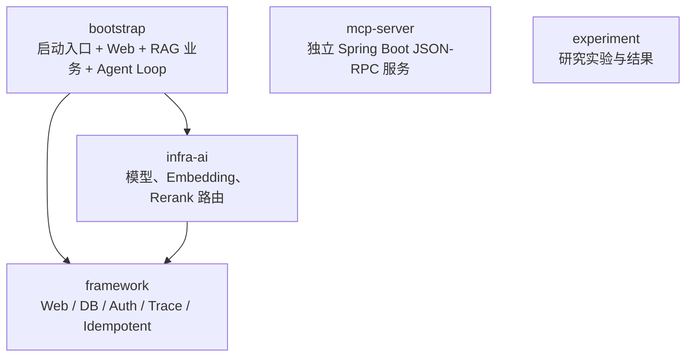
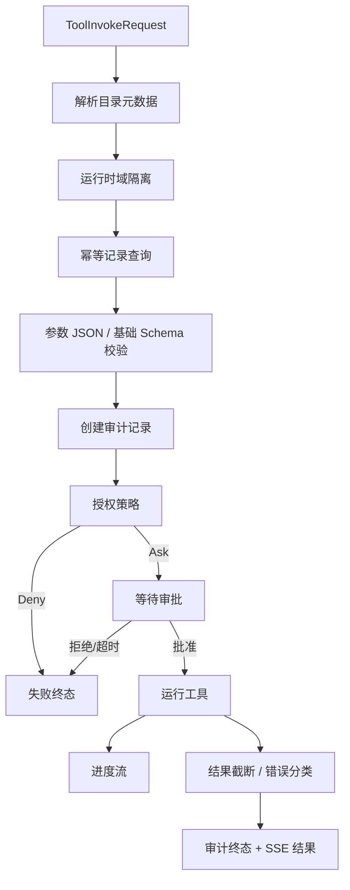
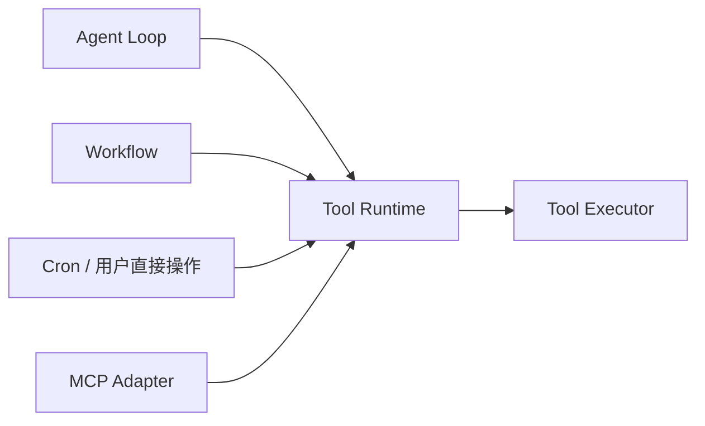
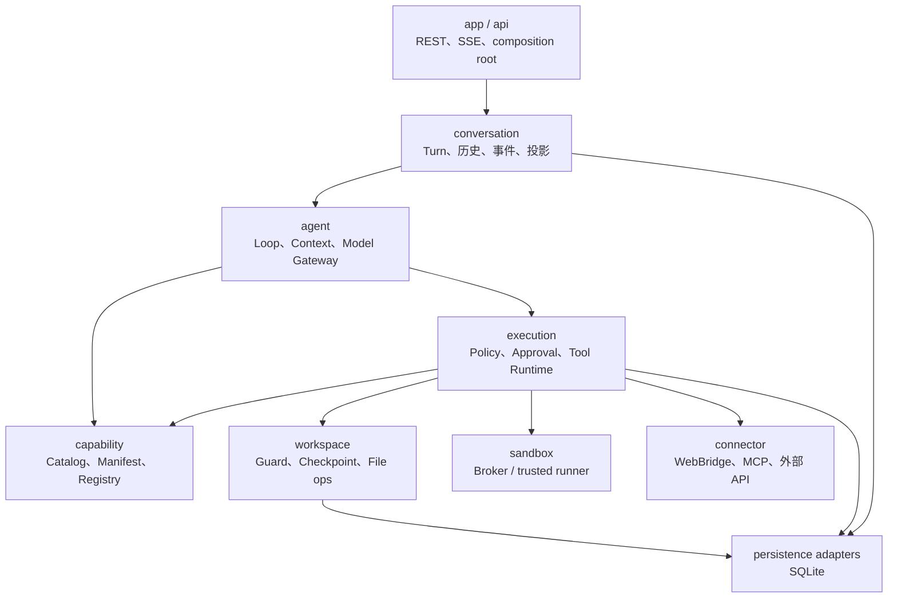
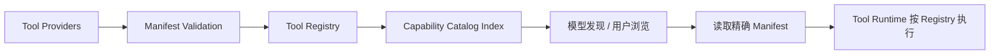
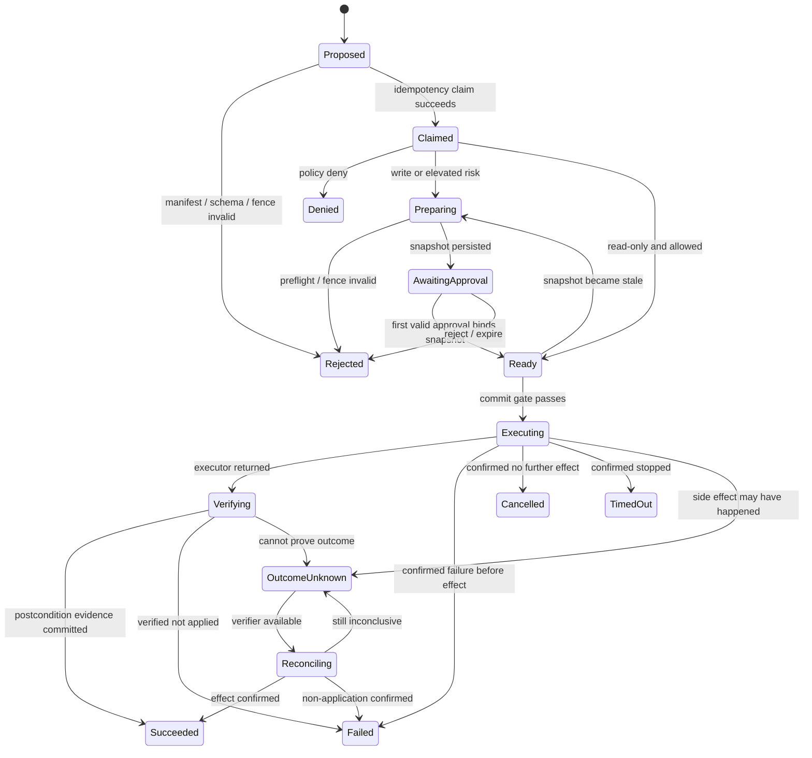

# 13 · 后端研究：从参考实现到 Iris 的理想执行内核

> 状态：大陆 0 / 节点 0.3 研究稿
>
> 范围：从 ragent-lab 的 Java 实现和 MESCLI 的企业级工具平台中提取可验证的工程经验，重新设计 Iris 的最小后端模块、工具契约、能力发现、执行安全与恢复边界。本文不实现产品代码，也不把参考仓库的模块名当作 Iris 的最终架构。
>
> 本地证据基线：
>
> - `E:\IntelliJ IDEA\Project\ragent-lab`：Git commit `d0b5317773689614ab8c4cf35bb4535dbd936bfb`
> - `E:\code\WonWork\MESCLI`：WonWork SVN working copy revision `188`

## 1. 先说结论

ragent-lab 和 MESCLI 对 Iris 的价值不同：

- ragent-lab 主要证明 Java/Spring 中可以怎样实现模型端口、流式回调、候选模型降级、轻量 Agent Loop、策略路由和 MCP 适配；它更像一组 Java 落地点，不是 Iris 的架构模板。
- MESCLI 已经把企业约束带入工具执行：目录发现、授权、审批、审计、幂等、结果限额、取消、工作区和 Python 执行。但它仍处应用初期，部分边界只是“看起来存在”，还没有达到 Iris 五条不变量要求的恢复性和 fail-close 强度。

Iris 不应该在两者之间二选一。更理想的方向是：

```text
ragent-lab 提供 Java 实现词汇
        +
MESCLI 提供真实约束与失败样本
        +
Claude Code 提供可恢复 Agent Loop 协议
        +
Iris 的个人生活产品边界
        ↓
一个持久化、可发现、默认保守、可核验、不过度分层的后端内核
```

节点 0.3 得到的核心判断是：

1. **先做模块化单体，不先做 Maven 多模块或微服务**。Iris 首版是本机个人产品，进程边界只留给确实需要隔离的浏览器和沙箱。
2. **Registry、Catalog、Runtime 必须分开**。Registry 回答“这个精确工具能否执行”，Catalog 回答“当前情境下有哪些能力值得发现”，Runtime 回答“这次动作怎样安全完成”。
3. **审批和执行状态必须持久化**。内存里的 `TaskCompletionSource`、Promise 或 SSE 连接都只能是唤醒机制，不能成为事实来源。
4. **安全元数据不能靠名称推断**。写操作、风险、路径和幂等语义漏填时拒绝注册，而不是猜成一个默认值。
5. **审计不是执行之后补日志**。工具调用的规范化输入、审批、幂等键、外部结果和恢复状态从执行前就进入同一个生命周期。
6. **“进程工作目录”不是沙箱**。在 Windows 上没有真正隔离前，模型生成的任意 Python 不能被包装成“安全沙箱”。
7. **Iris 的最小模块按职责划分，不按技术名词堆层**。每个模块必须能回答自己拥有什么状态、暴露什么端口、不能做什么。
8. **高影响动作要批准精确快照，而不是批准一个工具名**。Prepare 与 Commit 分离，真正完成由 postcondition evidence 证明。

## 2. 证据边界与评价标尺

### 2.1 两个参考都不是模板

本文把源码中的内容分成三类：

| 类别 | 含义 |
|---|---|
| 源码事实 | 当前基线中能定位到具体文件和符号的行为 |
| Iris 判断 | 基于五条不变量和个人产品定位作出的取舍 |
| 待验证设计 | 需要在 0.4 或后续实现中用真实能力继续验证 |

ragent-lab 的 README 自称企业级 RAG 平台，但其 Agent Loop 明确标为 Mini/MVP；MESCLI 的工具平台覆盖面很大，却仍有内存态审批、推断式风险和默认放行等早期实现。名称、注释和类数量都不能代替行为审计。

### 2.2 评价一个后端机制的六个问题

每个参考设计都用同一组问题检查：

1. 状态真相存在哪里，进程崩溃后还能不能恢复？
2. 权限或元数据异常时，是拒绝还是默认继续？
3. 同一动作重复到达时，是否可能产生第二次副作用？
4. 前端断线是否改变执行事实？
5. 模型、用户和开发者能否理解失败属于哪一类？
6. 这层抽象减少了真实复杂度，还是只把代码换了目录？

### 2.3 凭据卫生警告

ragent-lab 当前 `bootstrap/src/main/resources/application.yaml` 存在直接写入的疑似真实模型密钥，以及明文数据库和 Redis 凭据。本文不读取、不复制任何值。

这不是可借鉴实践。相关密钥应撤销、轮换并从版本历史清理。Iris 仓库只保存配置键和占位符；真实秘密应由环境注入或 Windows 本机密钥存储提供，日志、SSE、审计参数和 Git 历史都不得出现明文。

## 3. ragent-lab：Java 能怎样落地，而不是 Iris 应怎样分包

### 3.1 实际模块依赖

父 POM 声明五个模块：



真实含义不是经典四层架构：

| 模块 | 实际职责 | Iris 评价 |
|---|---|---|
| `bootstrap` | 启动入口、Controller、知识库业务、数据库访问、对话记忆、Agent Loop、MCP client | 组合根与业务实现混在一起，不能照搬 |
| `framework` | SSE 包装、返回结构、异常、用户上下文、MyBatis、Redis、鉴权、幂等切面、Trace | 可提取小原语，但“通用框架桶”依赖过重 |
| `infra-ai` | provider client、模型候选、路由、健康状态、流式首包探测、Embedding/Rerank | 是最有参考价值的 Java 适配层 |
| `mcp-server` | 独立应用、JSON-RPC dispatcher、工具 registry 和示例 executor | 证明协议边界可独立，但与主应用重复抽象 |
| `experiment` | RAG/Agent 实验和结果 | 研究资产，不进入 Iris 运行内核 |

### 3.2 `bootstrap` 为什么名不副实

`bootstrap` 不只是启动器。当前源码中绝大多数 Java 文件都在该模块，包括：

- 用户与鉴权；
- 知识库、文档摄取和向量检索；
- 会话与消息持久化；
- Pipeline 与 Agent 路由；
- Mini Agent Loop；
- 主应用侧 MCP client 与 registry。

这说明模块名表达的是历史形成方式，不是稳定依赖规则。Iris 的 `bootstrap` 只能做 composition root：读取配置、装配端口、启动 Spring，不拥有业务状态机。

### 3.3 Mini Agent Loop 的教学价值和产品局限

ragent-lab 的 `AgentLoop` 清楚展示了 Java 里的最小循环：

```text
构造 messages 和 tools
→ 调兼容 OpenAI 的模型接口
→ 解析 tool_calls
→ 顺序执行 Tool
→ 拼回 tool result
→ 直到没有工具调用或达到最大轮数
```

它适合解释 function calling，却不适合直接进入 Iris：

- 工具全集每轮直接放进请求，没有发现阶段；
- `Tool` 只有名称、描述、输入 schema 和同步执行；
- 没有 schema 执行校验、风险、审批、路径围栏和幂等语义；
- Loop 内消息和工具历史只在内存；
- 每个工具调用没有持久化状态；
- provider HTTP 逻辑写在 Loop 内；
- 多个工具顺序执行，没有资源冲突模型；
- 错误被压成文本结果；
- `AgentLoopService` 加载了历史却在 MVP 中不使用；
- 最终答案生成完成后再切成小块并延时发送，是视觉模拟流式，不是真实模型流。

因此它是“Java 怎样写出循环”的参考，不是 0.2 已定义的可恢复协议。

### 3.4 值得采用的 Java 模式

#### 模型端口与 provider client 分离

`infra-ai` 把上层 `LLMService`、具体 `ChatClient`、模型选择和健康状态拆开。Iris 可以采用同类边界：

```text
Agent Kernel
→ ModelGateway
→ ProviderAdapter
→ 外部模型 API
```

内核不应知道百炼、OpenAI 或 Anthropic 的 URL 拼接方式。

具体到 Spring，构造器注入 `List<ProviderAdapter>` 后在启动期生成不可变索引，是一种轻量、可测试的插件收集方式。Iris 可以把同一模式用于模型 provider 和 ToolProvider，但注册阶段必须报告重复键与无效 manifest，不能静默覆盖。

#### 首包提交前缓冲

`RoutingLLMService` 在候选模型流式请求开始后，先用包装回调缓存事件；确认收到有效首包才把缓存提交给下游。失败候选的片段不会污染用户已看到的输出。

这个原理适合 Iris，但只能用于“尚未提交副作用的模型输出”。首包之后再失败，不能假设切换模型一定安全；Iris 仍需要 0.2 定义的失效事件和稳定历史边界。

#### 有界模型降级和健康状态

候选模型按顺序尝试，失败会更新内存健康状态；熔断器包含 closed/open/half-open。其价值是把“选模型”和“调用模型”分开。

Iris 首版不必复制复杂自动路由，但 `ModelGateway` 应保留：

- 标准化错误分类；
- provider adapter；
- 有界 fallback；
- 前台与后台请求的不同策略；
- 输出提交前的污染隔离。

#### 便宜路径与 Agent 路径分开

ragent-lab 用规则在 Pipeline 与 Agent 之间路由。具体的关键词和问题长度规则很脆弱，但产品思想值得保留：

> 能用确定性流程低成本完成的任务，不必为了展示自主性而启动完整 Agent Loop。

这与 Iris “有效结果 / 总成本”的评价方向一致。未来生活板块可以拥有稳定 workflow，模糊委托才进入 Agent 规划；路由依据应是能力前置条件和任务状态，而不是几个中文关键词。

#### SSE 关闭幂等

`SseEmitterSender` 用原子状态保证完成或失败只关闭一次。这是有用的通信原语，但 Iris 使用 WebFlux 后应对应为事件流生命周期管理，不能把 `SseEmitter` 本身当作任务状态。

### 3.5 MCP 模块提供的启发和反例

独立 `mcp-server` 实现了 initialize、ping、tools/list 和 tools/call，说明外部能力可以通过协议适配而不与 Agent Loop 同进程。

但当前仓库实际上存在多套相邻而未统一的 Tool/MCP 抽象：正式 Mini Agent、主应用 RAG MCP、独立 MCP server 和 experiment 各有自己的接口或适配层。独立 server 的 `tools/call` 直接执行 executor，没有统一审批、审计和风险闸门；部分 server 工具还通过 HTTP 回调主应用，形成运行时往返。Iris 不应让 MCP 成为绕过内核的第二条执行通道。

Iris 的原则应是：

```text
本地 Java Tool ─┐
MCP Tool ───────┼→ 统一 Manifest 校验 → 统一 Tool Runtime → 统一审批与审计
WebBridge Tool ─┘
```

MCP 是 provider/adapter，不是更高权限的工具类型。

### 3.6 异步生命周期不能用方法栈冒充

ragent-lab 还有一个很有价值的反例：Controller 返回 `SseEmitter` 后，真实 Agent 通过 `@Async` 继续运行。包在 Controller 方法外的幂等切面或 Trace 切面，会在异步任务真正结束前释放锁或记录“方法成功”。

Iris 因此不能把以下概念绑定：

```text
HTTP 方法返回 ≠ Turn 完成
SSE emitter 存活 ≠ 执行仍存在
AOP 方法耗时 ≠ Agent Run 耗时
```

幂等、取消、Trace 和终态都必须围绕持久化 `turnId / modelStepId / toolExecutionId`，而不是围绕 Java 调用栈。

## 4. MESCLI：企业约束已经出现，但恢复边界仍未闭合

### 4.1 工具执行链

MESCLI 的 `ToolExecutionService` 已把单次调用拆成较完整的链：



可取之处在于：

- 执行器不直接从 Controller 调 `ITool.InvokeAsync`；
- 执行前创建审计记录；
- 有 executionId、toolUseId 和 idempotency key；
- 审批事件包含风险、规范化参数和人话影响陈述；
- 工具上下文携带取消令牌和进度回调；
- 结果有字符预算、截断标记、结构化数据和错误分类；
- Controller 的认证身份覆盖客户端域参数；
- 目录隐藏之外还有执行期域校验。

这些都是“企业约束进入执行链”的正确方向。

### 4.2 Tool、目录元数据和运行时已经分成三层

MESCLI 的原子 `ITool` 很窄，只含名称、描述、参数和调用；丰富的风险、审批、权限、目录、幂等和结果策略在 `ToolCatalogItem` / attribute 中；执行行为由 `ToolExecutionService` 组合。

这个拆分优于把所有逻辑塞进 Tool 类，但当前存在两个真相源：

```text
ITool
  └── name / description / parameters / invoke

ToolCatalogMetadata + CapabilityService inference
  └── risk / path / tier / operation / approval / timeout / result policy
```

如果两边漂移，运行时保护会依据推断后的元数据，而不是工具真实行为。

### 4.3 推断式元数据为什么危险

当前 `CapabilityService` 会根据工具名推断：

- `delete_`、`modify_`、`send_`、`start_` 是否破坏性；
- `query_`、`get_`、`list_`、`report_` 等是否只读；
- 只读是否并发安全；
- risk、operation type、approval mode；
- category、tier、affected entity 和目录路径。

本地静态扫描约发现约 962 个直接实现 `ITool` 的类，其中约 111 个带目录元数据 attribute，显式路径更少。这个规模解释了为什么推断被引入，也证明它不能成为长期安全边界。

尤其危险的是：

- 未知 risk 会归一化成 `standard`；
- 一旦类带了 attribute，其 `OperationType` 默认值可能被当成显式 `Read`；
- 没有匹配命名前缀的写工具可能成为 `Mixed` 或普通风险；
- `export_` 被推断为只读，但生成文件本身会改变工作区；
- 未标注工具默认可能始终加载；
- 重名工具采用“first wins”，没有在启动期拒绝。

Iris 的安全字段必须注册时完整，不允许运行时猜测。

### 4.4 Catalog 与 Registry 的混合

MESCLI 已有：

- Registry：反射扫描工具、按名称延迟实例化、执行；
- CapabilityService：搜索、树导航、schema 读取、加载策略、风险展示；
- DomainCatalog：按系统域过滤和从命名空间推断路径。

它证明能力目录和执行注册表需要不同接口，但当前 Catalog 会实例化工具、重新推断路径、去重改写路径，并把命名空间、attribute 和工具名同时当作目录来源。

Iris 应只保留一个稳定链：

```text
源码目录 / provider descriptor
→ 注册时生成并验证 ToolManifest
→ Registry 保存精确执行绑定
→ Catalog 从已验证 Manifest 建索引和多视角投影
```

Catalog 可以新增情境、对象和个人偏好索引，但不能修改工具的唯一地址。

### 4.5 审批：协议形状正确，事实来源错误

MESCLI 会发出 `approval_required`，其中包含：

- executionId；
- toolUseId；
- 原始参数；
- risk level；
- impact statement；
- 过期时间。

这是很好的审批载荷形状。

但等待状态保存在单例进程内的并发字典和 `TaskCompletionSource` 中：

- 进程重启后等待状态消失；
- SSE 断开会通过请求取消令牌影响等待；
- 决议没有数据库 compare-and-set；
- 审批请求没有不可变 action hash；
- `ApprovalDecisions` 可以随工具调用请求传入，后端授权逻辑会采信同一 toolUseId 的 approved 标记；
- 审批决议没有证明它对应哪一版 manifest 和哪一份规范化输入。

Iris 不能信任前端声称“已经批准”。前端只能提交：

```text
approvalRequestId + decision + optional reason
```

后端从数据库读取待审批动作，以 action hash 和状态机验证，再原子完成第一次合法决议。

### 4.6 审计和幂等：已接近正确问题，仍缺并发闭合

MESCLI 的 SQLite `AiToolExecution` 保存 executionId、toolUseId、参数、摘要、状态、幂等键、时间和 trace，执行前写入 queued，完成后更新终态。

值得采用：

- 幂等检查发生在副作用之前；
- 成功的幂等工具可返回已有结果；
- 非幂等重复调用被拒绝；
- result summary 与 structured data 分开；
- 查询接口可以读取执行状态。

仍有缺口：

- idempotency key 只有普通索引，没有 `(tool, key)` 唯一约束，并发请求可能同时通过查询；
- 查询再插入不是一个原子 claim；
- 进程崩溃会留下 queued/running，但没有启动恢复器；
- 没有 `outcome_unknown`；
- 失败记录允许同 key 再执行，却没有区分“确认未执行”和“执行结果未知”；
- 审计完成依赖请求取消令牌，客户端断线可能让终态写入也被取消；
- raw result、model view 和 UI artifact 没有稳定分层；
- affected entities 字段存在，但执行链没有完整写入证据。

Iris 应把 `tool_execution` 当作规范状态，不另造一份易漂移的“运行内存状态”。

### 4.7 授权：服务器身份是优点，异常放行是红线

正确方向：

- Controller 从认证上下文生成 ToolContext；
- 客户端不能覆盖 systemCode；
- 目录过滤之外还有执行期域拒绝；
- 支持数据范围、功能权限、deny pattern 和 SQL 动态分类。

必须拒绝：

- 权限服务异常时记录警告后默认允许；
- 非法 deny regex 被忽略；
- 请求体自带 approval decisions 可绕过真实审批；
- 字符串正则只能作为快速拒绝，不能代替结构化 SQL/动作语义校验。

Iris 的策略异常必须是 `policy_unavailable` 或拒绝，绝不能降成 allow。

### 4.8 工作区：原子写雏形可取，路径围栏仍有缝

MESCLI 工作区服务已有：

- 虚拟路径映射；
- `Path.GetFullPath` 规范化；
- 临时文件写完再 move 覆盖；
- 每个物理路径的进程内锁；
- 上传大小、扩展名、magic bytes 和 checksum；
- 非空目录不直接删除；
- 尝试检查符号链接目标。

但它不满足 Iris 的路径围栏：

- 支持 `/project` 指向工作区外任意用户目录；
- containment 用字符串 `StartsWith(root)`，缺少目录段边界；
- 只解析最终目标的链接，没有逐个检查祖先 reparse point；
- 链接解析异常会忽略，而不是 fail-close；
- `AuthorizeAsync` 当前固定返回 true；
- 写前没有 checkpoint；
- 路径校验和实际打开之间仍有 TOCTOU；
- 删除和覆盖没有统一审批绑定。

Iris 首版只允许一个显式 workspace root。需要访问外部文件时，应先由用户导入或明确更换工作区，而不是为单次工具调用询问越界放行。

### 4.9 Python：执行器不等于沙箱

MESCLI 同时支持本地进程和 Docker：

| 模式 | 已有保护 | 主要问题 |
|---|---|---|
| process | 独立工作目录、超时、输出捕获、清理目录 | 对宿主文件系统和网络几乎没有隔离；工作区路径只靠约定；外部取消没有完整终止进程 |
| Docker | 无网络、只读根文件系统、CPU/内存限制、临时目录 | 整个 workspace 和 project 以读写挂载；Windows 个人产品依赖重；命令行拼装和宿主挂载仍需审计 |

pip 黑名单不是安全模型。模型可以不用某个包也完成危险系统调用；本地 process 模式安装包还会改变宿主 Python 环境。

Iris 在真正隔离前必须诚实命名：

- `TrustedScriptRunner`：只运行内置或用户明确选择的脚本；
- `SandboxBroker`：未来负责受限身份、资源限制、网络和文件挂载；
- 不能把任意模型代码送进普通 `python.exe` 后称为 sandbox。

### 4.10 APS 业务里真正成熟的提交边界

MESCLI 最值得 Iris 学的部分不只在通用 `ToolExecutionService`，还在 APS 发布链路。它已经形成一条比“一次 Tool 调用”更接近真实生产动作的路径：

```text
自然语言需求
→ 校验并生成 Draft
→ 下一轮由用户确认
→ 冻结参数快照并计算 hash
→ 绑定计划、快照和引擎版本
→ 发布前重新检查 current state 与冲突
→ Serializable 事务内写入
→ 写后验证
```

其中几个细节尤其重要：

- `IrisApsUnderstandDemandTool` 只返回 `AWAITING_CONFIRMATION`，并明确禁止同一轮创建、启动或发布；
- 参数快照以数据库事务保存；同一 snapshot ID 不能改成不同内容，读取时还会重算 hash；
- 发布批准同时比较用户复核 hash、计划实际使用的 hash、当前参数 hash 和引擎版本，任何变化都会使旧批准失效；
- 发布前检查主数据、已执行状态和冲突策略；
- 真正写入处使用 `Serializable` 事务、发布 marker 和提交前的 postcondition count。

这比“给工具名点一次允许”多了一层关键语义：用户批准的不是抽象能力，也不是会继续变化的请求参数，而是一个**不可变、可预览、可哈希的 Operation Snapshot**。

Iris 应把它泛化为：

```text
Prepare / Draft
→ Preflight
→ Operation Snapshot
→ Approval Grant
→ Durable Claim
→ Commit Gate
→ Postcondition Verify
→ Reconcile
```

并不是每个 `read_only` 工具都需要完整八步；但文件覆盖、网页提交、付款、发送消息等真实写动作都应能选择这套协议。审批后若目标版本、资源声明、执行器版本或预检结果变化，旧 grant 自动失效。

### 4.11 持久化记录不等于可恢复，已有主通道也不代表没有旁路

APS 跨工序协调器会先保存 run 和需求血缘，再放入内存 `Channel`，这是正确方向；但当前没有看到启动时把未完成 run 重新入队。由此只能得出“状态被记录”，不能得出“流程可恢复”。

更危险的是绕过主通道：

- `ToolTestController` 直接从 Registry 取 Tool 并调用，还提供任意 SQL 测试入口；
- workflow 内存在直接业务数据库调用，不经过统一 Runtime；
- `/workspace` 静态文件映射位于主要认证中间件之前，扩大了工作区暴露面。

这些可以是开发期便利，但只要能进入产品构建或监听到非本机接口，就会使 Runtime 的审批、审计、身份和结果预算失去意义。Iris 因此需要的不只是“大家约定走 Runtime”，而是依赖结构、公开 API、构建 profile 和架构测试共同保证**唯一提交口**。

## 5. 取其精华、去其糟粕

### 5.1 直接采用的原理

| 原理 | 来源启发 | Iris 采用方式 |
|---|---|---|
| provider adapter 与模型路由分离 | ragent `infra-ai` | `ModelGateway` + provider adapter |
| fallback 输出先隔离再提交 | ragent 首包缓冲 | 只提交选定 Model Step 的事件 |
| 便宜确定性路径优先 | ragent Pipeline/Agent | workflow 与 Agent 按任务条件选择 |
| Registry 自动收集实现 | 两者 | 启动时扫描，但严格验证并拒绝冲突 |
| 工具执行外围流水线 | MESCLI | normalize → validate → policy → approval → execute → evidence |
| 执行前记录状态 | MESCLI audit | 原子 claim tool execution |
| 人话影响陈述 | MESCLI metadata | 审批请求必填且由规范化动作渲染 |
| 结果预算与结构化数据 | MESCLI | raw/model/UI 三层结果 |
| 服务端身份覆盖客户端参数 | MESCLI | policy 只信任后端上下文 |
| 临时文件后原子替换 | MESCLI workspace | checkpoint 后同目录 atomic replace |
| MCP/Bridge 作为独立 adapter | ragent MCP | 所有外部工具仍进入统一 Runtime |
| Draft 与副作用分轮 | MESCLI APS | 先准备可读预览，下一轮再确认精确动作 |
| 不可变参数快照和版本绑定 | MESCLI APS | 审批绑定 Operation Snapshot hash |
| 提交前冲突检查与提交后验证 | MESCLI APS | Commit Gate + evidence + reconcile |

### 5.2 需要改造的部分

| 参考实现 | Iris 改造 |
|---|---|
| ragent 多 Maven 模块 | 首版模块化单体，用 package 和架构测试守边界 |
| ragent callback/SseEmitter | WebFlux SSE 只做投影通道，事件先持久化 |
| ragent 自动模型 fallback | 服从 Model Step 是否已提交、工具是否已启动 |
| MESCLI metadata inference | 安全字段全部显式，缺失拒绝注册 |
| MESCLI 内存审批 | SQLite 持久化状态 + 进程内 notifier |
| MESCLI 查询式幂等 | 数据库唯一 claim + 状态恢复 |
| MESCLI runtime state dictionary | 数据库为真相，内存只持有可取消句柄 |
| MESCLI workspace 双根 | Iris 单根 fail-close |
| MESCLI process sandbox | 只作为 trusted runner，不宣称隔离 |
| MESCLI 企业 RBAC | 个人产品简化为风险、工作区和用户批准，不带工厂/车间模型 |

### 5.3 明确拒绝的部分

- 按工具名前缀猜安全属性；
- 权限服务异常时 allow；
- 重名工具 first wins；
- 前端在请求体里自证“已审批”；
- 把 SSE 断开等同任务取消；
- 只把日志称为审计；
- 把工作目录称为文件系统隔离；
- 为 Iris 引入 MySQL、Redis、Milvus、MyBatis、企业 RBAC 和分布式 ID；
- 同时维护本地 Tool 与 MCP Tool 两套执行安全链；
- 允许测试 Controller、workflow 或静态文件中间件绕过 Runtime 和认证；
- 用一个 `framework` 模块收纳所有跨领域便利代码；
- 为“未来也许需要”先拆微服务。

## 6. Iris 后端的设计原则

### 6.1 状态先于线程

线程、协程、SSE 订阅和进程都会消失。以下事实必须先进入 SQLite：

- User Turn 已接受；
- 模型提出了哪个 tool call；
- 规范化后的动作是什么；
- 为什么需要审批；
- 谁在何时作出什么决议；
- 工具何时开始；
- 当前结果已知、失败还是未知；
- 哪些文件和外部实体被影响；
- 哪些事件已投影给前端。

内存对象只能加速，不拥有事实。

### 6.2 一个动作只有一个安全入口

Controller、Agent Loop、workflow、定时任务、MCP 和 WebBridge 都不能直接调用 executor。它们统一提交 `ToolInvocation` 给 Tool Runtime。



如果存在第二条“方便”的直调路径，审批和审计迟早会被绕过。

### 6.3 安全字段没有默认猜测

以下字段缺失就不注册：

- 唯一 name；
- 一句话 description；
- 唯一 capability path；
- input schema；
- risk level；
- side-effect kind；
- approval policy；
- idempotency policy；
- timeout/result policy；
- executor binding。

未知值不是 `standard`，而是 invalid manifest。

### 6.4 Catalog 是发现视图，不是安全边界

模型搜索不到某工具，不代表不能恶意按名调用。Catalog 负责减少选择成本，Registry 和 Policy 才负责执行拒绝。

### 6.5 审批绑定动作，不绑定一句工具名

一次批准必须绑定：

```text
toolId + manifestVersion + normalizedInputHash + affectedResources + expiration
```

参数被用户修改、工具升级或执行资源变化，都需要生成新的审批请求。

### 6.6 每个完成都需要证据

本地文件写入的证据可以是 after hash；网页提交的证据可以是页面确认和业务编号；外部请求可以是服务端 idempotency key 与响应 ID。

`ToolResult.success = true` 只是 executor 声明，不自动等于用户目标完成。

### 6.7 把“准备”和“提交”拆成两个语义阶段

高影响动作先生成 `OperationSnapshot`：规范化参数、目标资源、预期变化、前置版本、执行器版本和可读预览。审批绑定它的 hash，`CommitGate` 在真正副作用前重新核验：

```text
approved snapshot == current commit intent
```

如果无法证明相等，就回到 Prepare，而不是带着旧批准继续执行。这允许日常能力既保留模型的灵活理解，又把最后一步压缩成确定、可检查的提交。

## 7. 最小模块清单

这些是逻辑模块，不代表首版要建立同名 Maven module。



### 7.1 `app`

职责：

- Spring Boot 启动；
- 配置绑定；
- Controller 和 WebFlux SSE endpoint；
- 端口到 adapter 的装配；
- 启动期 manifest 验证和恢复任务触发。

不负责：

- Agent Loop；
- 工具策略；
- SQL 业务逻辑；
- 会话真相。

### 7.2 `conversation`

职责：

- 接受 User Turn；
- 保存 canonical history；
- Turn / Model Step / Tool Call 关联；
- append-only conversation events；
- 为 SSE 重连生成投影；
- compact boundary 和 branch 事实。

关键端口：

```text
TurnService
ConversationEventStore
ConversationProjector
```

### 7.3 `agent`

职责：

- 驱动 0.2 的后端 Agent Loop；
- 生成 Context Frame；
- 调用 ModelGateway；
- 解析 tool use；
- 把 Tool Runtime 结果作为新观察；
- 管理 Model Step 级错误和 fallback。

关键端口：

```text
AgentKernel
ContextPlanner
ModelGateway
```

### 7.4 `capability`

职责：

- 验证 ToolManifest；
- 保存进程内精确 Registry；
- 从 Manifest 构造目录、搜索和 schema 读取；
- 接纳本地、MCP、WebBridge 等 provider；
- 未来承载高于 Tool 的 Capability card。

关键端口：

```text
ToolRegistry
CapabilityCatalog
ToolProvider
ManifestValidator
```

### 7.5 `execution`

职责：

- 规范化和验证 invocation；
- 对写动作执行 preflight 并冻结 Operation Snapshot；
- 原子 claim 幂等键；
- 评估风险、围栏和审批；
- 持久化 ToolExecution 与 ApprovalRequest；
- 在唯一 Commit Gate 复核批准、资源版本和执行器版本；
- 调度 executor、超时、取消和提交后核验；
- 保存 raw result、evidence 和终态；
- 对 `OutcomeUnknown` 发起 reconcile；
- 产生 conversation event。

关键端口：

```text
ToolRuntime
ToolPolicy
ApprovalService
OperationPreparer
CommitGate
ToolExecutionStore
EvidenceRecorder
OutcomeReconciler
```

### 7.6 `workspace`

职责：

- 唯一工作区根；
- 路径规范化和围栏；
- 逐层链接/reparse point 检查；
- 文件版本前置条件；
- 写前 checkpoint；
- 同目录原子替换；
- 产物登记和回滚。

关键端口：

```text
WorkspaceGuard
WorkspaceService
CheckpointStore
```

### 7.7 `sandbox`

职责：

- 为代码执行准备临时输入和输出；
- 资源、时间、网络和子进程限制；
- 区分 trusted runner 与真正 sandbox；
- 产物回收和运行目录清理。

首版可以只有端口和受限的 trusted runner；在 Windows 隔离方案确认前，不开放任意模型代码。

### 7.8 `connector`

职责：

- WebBridge client；
- MCP client/provider；
- 外部 HTTP/API adapter；
- 把外部进度、结果和证据映射成内核类型。

connector 不能自带一套审批和历史真相。

### 7.9 `persistence adapters`

SQLite 是实现，不是业务模块。Repository 接口留在拥有状态的模块中，SQLite adapter 实现这些端口。

不要创建一个所有模块都随意调用的 `DatabaseService`。

## 8. Tool 契约候选

这不是最终 Java 代码，而是 0.4 的字段边界。

```text
ToolManifest
  identity
    id
    name
    version
    capabilityPath
    description

  contract
    inputSchema
    outputSchema

  safety
    riskLevel
    sideEffectKind
    approvalPolicy
    impactStatementTemplate
    idempotencyPolicy
    resourceClaims

  runtime
    timeout
    resultBudget
    executorBinding

  outcome
    evidenceContract
    verificationPolicy
    recoveryHint
```

`ToolManifest` 描述某一版本的能力边界；`OperationSnapshot` 描述某一次准备完成、等待批准的精确动作。不能把后者塞回前者，也不能只保存一个前端展示字符串。

### 8.1 路径怎样成为单一真相

AGENTS.md 规定文件目录就是能力树路径。因此：

- 本地 Java Tool 的 `capabilityPath` 由 `tools/<domain>/<dir>/XxxTool.java` 对应的 package/directory 派生；
- manifest 对外包含 path，但工具类不能再手写另一份冲突映射；
- 编译或启动验证 package 与目录；
- remote provider 必须显式提供稳定 namespace；
- duplicate path/name 直接导致 provider 注册失败。

### 8.2 风险等级

Iris 保留四档：

| 等级 | 含义 | 默认处理 |
|---|---|---|
| `read_only` | 不改变外部状态 | 可直接执行，仍受围栏和预算限制 |
| `standard` | 可控、低影响写操作 | 必须审批 |
| `elevated` | 影响账号、公开内容、广泛文件或敏感数据 | 强审批、短过期、清晰预览 |
| `destructive` | 删除、支付、提交不可逆动作 | 强审批、额外核验，部分能力首版禁用 |

`riskLevel` 不等于权限结论。read-only 越界仍拒绝，destructive 被批准后仍需满足所有前置条件。

### 8.3 幂等策略

至少区分：

```text
NATURAL_KEY       外部系统或业务对象提供天然唯一键
CLIENT_KEY        Iris 生成并传给支持幂等键的 API
VERIFY_BEFORE_RETRY
NON_IDEMPOTENT
```

一个 `boolean idempotent` 不足以告诉恢复器怎样行动。

### 8.4 Resource Claims

工具声明本次输入会读写哪些资源：

```text
read  workspace:/notes/**
write workspace:/reports/week.md
write browser-session:personal
write external:job-application/{company}/{position}
```

它同时服务于并发调度、审批影响陈述、审计和未知结果核验。

## 9. Capability Catalog 与 Tool Registry

### 9.1 Registry

Registry 是严格、窄而确定的运行时索引：

```text
ToolId / name → validated manifest + executor binding
```

它提供：

- 注册；
- 按稳定 ID/名称精确读取；
- provider 下线；
- manifest version；
- duplicate 拒绝。

它不提供模糊搜索，不根据用户习惯排序。

### 9.2 Catalog

Catalog 是可重建的发现投影：

- 目录导航；
- 文本搜索；
- schema 按需读取；
- 情境、对象、来源和个人偏好索引；
- 工具、workflow、模板和复合 Capability card；
- 当前可用性及缺失前置条件。

Catalog 记录可以被重新索引；Registry 的执行身份不能被搜索排序改变。

### 9.3 两者关系



Capability 可以组合多个 Tool，但不能伪装成一个无中间状态的巨大 executor。

## 10. Tool Runtime 状态机



### 10.1 关键事务边界

1. 接收调用后先规范化输入和计算 action hash。
2. 在 SQLite 中以唯一键原子 claim，不做“先查再插”。
3. 保存 `Claimed` 后才允许发审批或执行事件。
4. 写动作先保存不可变 `OperationSnapshot`，再创建审批。
5. 审批决议用状态条件更新，只有第一份与 snapshot hash 相符的合法决议成功。
6. `CommitGate` 重查 manifest、target/resource version 和 snapshot hash；通过后持久化 `Executing`。
7. 外部结果先进入 `Verifying`，证据与终态尽量同一事务提交。
8. 无法证明是否生效时记录 `OutcomeUnknown`，绝不把超时直接写成失败。
9. SSE 从已保存事件投影，不负责决定状态。

### 10.2 重启恢复

启动时扫描非终态：

| 状态 | 恢复动作 |
|---|---|
| `Claimed` | 重新跑 policy |
| `Preparing` | 原准备过程无副作用，可重新生成或标记失败 |
| `AwaitingApproval` | 恢复等待并重新投影审批卡 |
| `Ready` | 尚未执行，可安全入队 |
| `Executing` read-only | 可按策略重跑 |
| `Executing` 有可靠幂等键 | 查询或复用相同 key |
| `Executing` 外部非幂等写 | 进入 `OutcomeUnknown`，先核验 |
| `Verifying` | 重新执行 evidence contract，不重复副作用 |
| `OutcomeUnknown` | 按 recovery hint 调度 reconcile，必要时请求人工确认 |

## 11. 审批最小实体

`ApprovalRequest` 至少保存：

```text
approvalRequestId
toolExecutionId
toolId + manifestVersion
operationSnapshotId + operationSnapshotHash
normalizedInputHash
impactStatement
riskLevel
affectedResources
targetVersions
executorVersion
status
createdAt / expiresAt
decidedAt
decision / reason
```

`ApprovalGrant` 是已决定的不可变事实，不能由调用方在下一次请求里自报。进程内 notifier 可以等待数据库变化，但 notifier 丢失不会丢审批。拒绝、过期、取消也产生明确终态。

## 12. 工作区、Checkpoint 与沙箱的最小形态

### 12.1 WorkspaceGuard

路径解析顺序：

1. 只接受 workspace-relative logical path；
2. 拒绝绝对路径、UNC、device path、空字节和非法段；
3. 在唯一 root 下 resolve + normalize；
4. 用路径段语义检查 containment，不用字符串前缀；
5. 检查每个已存在祖先的 symlink/reparse point；
6. 无法解析就拒绝；
7. 写入前再次校验父目录和文件版本；
8. executor 只拿已解析的受保护句柄/对象，不再自行拼路径。

### 12.2 Checkpoint

每个文件写操作在执行前记录：

- logical path；
- change kind：create/update/delete；
- before hash、size、mtime；
- 原内容快照或内容寻址引用；
- toolExecutionId；
- 创建时间。

写入使用同目录临时文件和原子 replace。成功后记录 after hash。回滚也是新的受审计写动作，不能静默改历史。

### 12.3 Sandbox 的阶段选择

| 方案 | 隔离强度 | 产品代价 | 当前判断 |
|---|---:|---:|---|
| 普通 Python 子进程 | 低 | 低 | 只用于 trusted script |
| Docker/容器 | 中高 | Windows 安装和体积高 | 开发/高级模式候选 |
| Windows 受限 helper（受限 token、Job Object、ACL） | 目标上更匹配 | 实现与验证成本高 | M3 前专项研究 |

0.3 不替用户冻结最终方案。硬结论只有一个：没有操作系统级边界，就不能承诺任意模型代码安全。

即使未来有真正 sandbox，也不应把整个 workspace 读写挂载进去。更窄的默认路径是：Runtime 把声明过的输入复制或只读映射到 staged input，sandbox 只能写独立 output，结束后再由 WorkspaceGuard 把产物作为新的受审批动作导入工作区。

## 13. 首版持久化最小集合

不冻结列结构，但必须覆盖以下事实：

| 聚合 | 必须持久化的内容 |
|---|---|
| Conversation Event | 消息、Turn、Model Step、Tool Call、分支、压缩、SSE 投影序号 |
| Tool Execution | manifest 版本、输入、action hash、幂等键、状态、结果引用、错误、证据 |
| Operation Snapshot | 规范化动作、资源与版本、预期变化、预览、hash、executor version |
| Approval Request / Grant | 精确 snapshot、影响、决议、过期 |
| Checkpoint | 路径、before/after、快照引用、关联执行 |
| Artifact | 大结果、文件、媒体、校验和、可见性 |

SQLite 足以承载首版。先用唯一约束、事务和状态条件更新解决一致性，不引入 Redis 或消息队列。

## 14. Java 工程组织建议

### 14.1 首版采用模块化单体

建议一个 Spring Boot backend Maven module，内部 package 按业务能力划分：

```text
com.iris.app
com.iris.conversation
com.iris.agent
com.iris.capability
com.iris.execution
com.iris.workspace
com.iris.sandbox
com.iris.connector
```

每个 package 内部可再按 `api / application / domain / adapter` 组织，但只有复杂度真实出现时才拆。不要在第一天复制八套空目录。

### 14.2 用依赖规则代替模块数量

可以用架构测试验证：

- connector 不调用 Controller；
- executor 不调用 approval UI；
- capability catalog 不直接执行工具；
- conversation 不依赖具体 provider SDK；
- workspace guard 不能被 file tool 绕过；
- app 是唯一 composition root。

### 14.3 什么时候再拆 Maven module

满足至少一个条件再拆：

- 需要独立进程或不同权限身份；
- 需要单独发布的 SDK/provider；
- 编译依赖确实隔离；
- 团队协作边界长期稳定；
- 可通过公开接口独立测试。

WebBridge daemon 和未来 sandbox helper 满足进程隔离理由；普通业务 package 暂时不满足。

## 15. 设计决策记录

### D13-01：ragent-lab 是实现参考，不是架构基线

- 决定：学习 Java 模型路由、流式控制和 MCP 适配，不继承其模块布局。
- 原因：`bootstrap` 含大量业务，Agent Loop 是教学型 MVP。

### D13-02：MESCLI 是约束样本，不是成熟安全证明

- 决定：采用执行前审计、审批载荷、结果预算等原理，同时显式记录其恢复和 fail-close 缺口。
- 原因：企业功能覆盖面与内核可靠性不是同一个指标。

### D13-03：首版是模块化单体

- 决定：一个 Spring Boot 后端，按职责 package 隔离。
- 原因：个人本地产品不需要分布式基础设施；事务和恢复更重要。

### D13-04：Catalog 与 Registry 分离

- 决定：Catalog 是发现投影，Registry 是精确执行绑定。
- 原因：搜索、个性化和目录重建不能改变执行身份。

### D13-05：安全元数据缺失即注册失败

- 决定：风险、路径、审批、幂等和 schema 不做名称推断。
- 原因：推断可以改善展示，不能决定外部副作用。

### D13-06：审批和执行状态持久化

- 决定：SQLite 是真相；内存对象只唤醒等待者。
- 原因：重启、重连和取消不能丢失动作事实。

### D13-07：所有能力统一经过 Tool Runtime

- 决定：Agent、workflow、MCP、Cron 和 WebBridge 不直调 executor。
- 原因：避免出现绕过 policy/audit 的第二通道。

### D13-08：普通进程不称为沙箱

- 决定：未完成 OS 隔离前，只开放 trusted runner。
- 原因：工作目录、超时和包黑名单不能限制宿主文件与网络。

### D13-09：高影响动作审批不可变 Operation Snapshot

- 决定：Prepare 生成快照和预览，批准绑定 snapshot hash；唯一 Commit Gate 在副作用前复核版本和资源状态。
- 原因：用户看过的内容与真正执行的内容必须可证明相同，旧批准不能漂移到新动作。

### D13-10：完成状态由 postcondition 决定

- 决定：executor 返回后进入 `Verifying`；证据不足进入 `OutcomeUnknown` 和 reconcile。
- 原因：网络超时、进程退出或 `success=true` 都不能证明外部状态。

## 16. 留给 0.4 和后续实现的开放问题

1. `conversation_event` 与业务投影表怎样取得最小平衡？
2. ToolManifest 由注解、静态 descriptor 还是构建期处理器生成？
3. action hash 的 canonical JSON 规则是什么？
4. SQLite 如何实现领取执行、审批决议和事件序号的并发事务？
5. WebFlux 流取消是否默认只取消订阅，还是向 Turn 提交显式 Stop？
6. Windows 真正可接受的沙箱边界是什么？
7. `OperationSnapshot` 的 canonical hash、目标版本和预览格式如何统一？
8. 不同副作用的 postcondition verifier 和 reconcile 何时自动、何时人工？
9. Capability card 如何表达高于原子 Tool 的情境、证据和恢复？
10. 少数深生活板块中，哪些任务应该走固定 workflow，哪些留给 Agent？
11. credential storage 使用 DPAPI、Windows Credential Manager 还是其他本机方案？

这些问题不妨碍确定模块职责，但不应由 0.3 擅自冻结。

## 17. 验收：最小模块和调用关系

节点 0.3 的验收答案可以压缩成一句话：

> Iris 后端首先是一个模块化单体：Conversation 保存不可丢历史并驱动 Agent，Agent 只通过 Capability 发现能力并把候选动作交给 Tool Runtime；Runtime 用持久化状态机统一完成 manifest 校验、幂等 claim、Prepare、精确快照审批、唯一 Commit Gate、执行、postcondition 验证与 reconcile，再由 Workspace、Sandbox 或 Connector adapter 接触真实世界，所有结果先落 SQLite 后经 SSE 投影给前端。

最小核心模块：

1. `app`
2. `conversation`
3. `agent`
4. `capability`
5. `execution`
6. `workspace`
7. `sandbox`
8. `connector`

其中真正的依赖主链是：

```text
API
→ Conversation / Turn
→ Agent Kernel
→ Capability Discovery
→ Tool Runtime
→ Policy / Approval
→ Executor Adapter
→ Evidence + Canonical History
→ SSE Projection
```

## 18. 证据索引

### 18.1 ragent-lab

| 主题 | 证据位置 |
|---|---|
| Maven 模块与依赖 | `ragent-lab/pom.xml`；各模块 `pom.xml` |
| 应用启动入口 | `bootstrap/src/main/java/com/nageoffer/ai/ragent/RagentApplication.java` |
| Mini Agent Loop | `bootstrap/src/main/java/com/nageoffer/ai/ragent/rag/agentloop/AgentLoop.java:57`、`:104`、`:130` |
| 最小 Tool 接口 | `bootstrap/src/main/java/com/nageoffer/ai/ragent/rag/agentloop/Tool.java:46` |
| Agent Service 的历史、工具和模拟流 | `bootstrap/src/main/java/com/nageoffer/ai/ragent/rag/agentloop/AgentLoopService.java:103`、`:125`、`:139`、`:146`、`:161`、`:249`、`:258` |
| Pipeline / Agent 路由 | `bootstrap/src/main/java/com/nageoffer/ai/ragent/rag/strategy/StrategyRouter.java:43`、`:92`、`:140` |
| LLM 端口与路由 | `infra-ai/src/main/java/com/nageoffer/ai/ragent/infra/chat/LLMService.java:48`；`RoutingLLMService.java:53` |
| 首包缓冲和 fallback | `infra-ai/src/main/java/com/nageoffer/ai/ragent/infra/chat/RoutingLLMService.java:93`、`:108`、`:129`、`:218` |
| 模型健康状态 | `infra-ai/src/main/java/com/nageoffer/ai/ragent/infra/model/ModelHealthStore.java:33`、`:47`、`:80`、`:96` |
| SSE 关闭控制 | `framework/src/main/java/com/nageoffer/ai/ragent/framework/web/SseEmitterSender.java:34`、`:67`、`:91`、`:109` |
| 主应用 MCP Registry | `bootstrap/src/main/java/com/nageoffer/ai/ragent/rag/core/mcp/DefaultMCPToolRegistry.java:41` |
| 独立 MCP dispatcher | `mcp-server/src/main/java/com/nageoffer/ai/ragent/mcp/endpoint/MCPDispatcher.java:41`、`:45`、`:94` |
| 凭据卫生问题 | `bootstrap/src/main/resources/application.yaml:18`、`:31`、`:99`、`:106`（不记录值） |

### 18.2 MESCLI

| 主题 | 证据位置 |
|---|---|
| 最小 ITool | `MESCLI/AIGateway/Tools/ITool.cs:5` |
| 丰富目录元数据 | `MESCLI/AIGateway/Models/ToolCatalogItem.cs:5`；`Tools/ToolCatalogMetadataAttribute.cs:10` |
| Registry 扫描、懒实例化和重名策略 | `MESCLI/AIGateway/Tools/ToolRegistry.cs:7`、`:31`、`:64`、`:184` |
| 目录推断与发现 | `MESCLI/AIGateway/Services/CapabilityService.cs:228`、`:267`、`:423`、`:517`、`:686`、`:774` |
| 完整执行链 | `MESCLI/AIGateway/Services/ToolExecutionService.cs:57`、`:76`、`:99`、`:145`、`:157`、`:170`、`:189`、`:257`、`:304`、`:348` |
| 授权与异常默认放行 | `MESCLI/AIGateway/Services/ToolAuthorizationService.cs:39`、`:80`、`:109`、`:152` |
| 内存审批 | `MESCLI/AIGateway/Services/ToolApprovalService.cs:30`、`:40`、`:58` |
| 内存取消状态 | `MESCLI/AIGateway/Services/ToolExecutionStateService.cs:17`、`:27`、`:36` |
| SQLite 审计与幂等查询 | `MESCLI/AIGateway/Services/Audit/LocalToolExecutionAuditService.cs:23`、`:77`、`:125` |
| 执行表索引 | `MESCLI/AIGateway/Data/Local/LocalDbInitializer.cs:168`、`:192` |
| SSE 执行与审批接口 | `MESCLI/AIGateway/Controllers/ToolsController.cs:41`、`:107`、`:135`、`:155` |
| Workspace 写入与授权占位 | `MESCLI/AIGateway/Services/WorkspaceFileService.cs:349`、`:378`、`:514`、`:540` |
| 路径与链接校验 | `MESCLI/AIGateway/Services/WorkspaceFileService.cs:641` |
| Python runner / sandbox broker | `MESCLI/AIGateway/Services/PythonSandboxService.cs:26`、`:180`、`:225` |
| 本地进程执行器 | `MESCLI/AIGateway/Services/ProcessSandboxExecutor.cs:37`、`:52` |
| Docker 执行器 | `MESCLI/AIGateway/Services/DockerSandboxExecutor.cs:10`、`:27` |
| 需求只生成草稿并跨轮确认 | `MESCLI/AIGateway/Tools/Iris/Aps/IrisApsUnderstandDemandTool.cs:101`、`:124`、`:130`、`:134`、`:151` |
| 不可变参数快照与读回验 hash | `MESCLI/AIGateway/Services/Aps/ApsParameterSnapshotStore.cs:23`、`:39`、`:44`、`:112`、`:115`、`:146` |
| 审批绑定复核 hash、当前快照和引擎版本 | `MESCLI/AIGateway/Services/Aps/ApsParameterApprovalPolicy.cs:18`、`:24`、`:31`、`:33`、`:35` |
| 发布前 stale / 幂等 / 冲突检查 | `MESCLI/AIGateway/Tools/Iris/Aps/IrisApsPublishTool.cs:94`、`:105`、`:121`、`:196`、`:214` |
| Serializable 提交与写后验证 | `MESCLI/AIGateway/Services/Aps/IrisMoldingPlanPublisher.cs:152`、`:168`、`:171`、`:180`、`:224`、`:286`、`:294` |
| 持久 run 后进入不可恢复内存队列 | `MESCLI/AIGateway/Services/Aps/ApsCrossProcessSimulationCoordinator.cs:40`、`:79`、`:118`、`:131` |
| Tool / SQL 测试旁路 | `MESCLI/AIGateway/Controllers/ToolTestController.cs:25`、`:30`、`:41`、`:70`、`:80` |
| Workflow 直接分派数据库写入 | `MESCLI/AIGateway/Workflow/WorkflowEngine.cs:106`、`:132`、`:256`、`:282`、`:312`、`:347` |
| MES 认证前的静态文件与 workspace 映射 | `MESCLI/AIGateway/Program.cs:335`、`:372`、`:390`、`:395`、`:417` |

本文没有复制参考项目源码；图、状态机、模块边界、契约和 Iris 取舍均为重新抽象。
