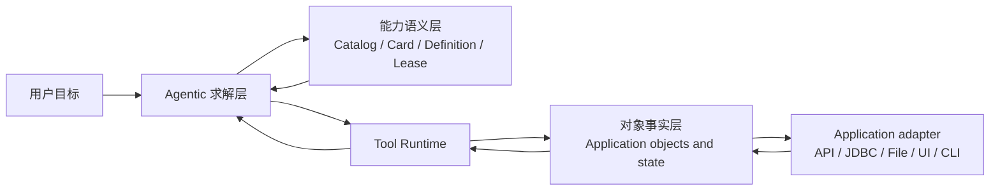

# 26 · Application 对象与能力：一条待验证的产品假设

> 状态：探索中。本文记录 2026-07-28 出现的一条设计直觉，用于指导近期纵切，
> 不是不可修改的架构约束。后续实现和真实对话可以验证、修正或否定它。

## 1. 直觉从哪里来

Iris 的目标不只是把操作系统命令换一层名字包装成 Tool。它更可能需要直接利用
Application 已经形成的对象、状态和动作：

- 数据库中有 Connection、Schema、Table、Row；
- 浏览器中有 Page、Form、Field、Submission；
- 工业系统中有工单、设备、工序、告警；
- 文档应用中有 Document、Sheet、Section、Artifact。

底层实现可以是 API、JDBC、文件、CLI 或 UI 自动化，但模型不应被迫首先理解这些
adapter。模型更需要知道：正在面对什么对象、对象现在是什么状态、允许做什么，以及
怎样证明动作成功。

这里的“面向对象”也不是要求所有能力都写成 Java class 或 ORM。Java 类型与 SQL
表结构之间的映射（例如 MyBatis 中类对应表、实例对应行）提供了灵感：结构化对象可以
降低理解成本。但不同 Application 的身份、状态和副作用差异很大，不能强行套入统一
继承树。

## 2. 暂定的三层关系



### 2.1 对象事实层

保存或读取真实对象的身份与状态。它回答“对象是什么、现在怎样”，不负责决定用户目标。

一个对象未必由 Iris 持久化。数据库行可以仍在数据库中，浏览器页面可以仍在浏览器
会话中；Iris 只保存完成当前任务所需的稳定引用、版本事实和 provenance。

### 2.2 能力语义层

用类似文件系统的分层方式组织“系统能对哪些对象做什么”，让模型逐步发现：

```text
Capability path
→ compact Card
→ exact Definition
→ stable proxy invocation
```

它是面向模型的语义索引，不是 Application 对象数据库。Capability Catalog 不拥有
表、工单或页面；对象消失也不应删除历史 ToolCall 所引用的 Definition。

### 2.3 Agentic 求解层

把自然语言目标转成一次可验证的求解过程：

```text
理解目标
→ 发现能力
→ 选择或观察对象
→ 执行动作
→ 接收 observation
→ 验证结果或恢复
```

Agentic、能力目录和对象系统可以独立演进，但会在一次任务中协作。固定成功过程以后
可以沉淀为 Pipeline；Pipeline 仍调用相同 Tool Runtime，不另建一套对象访问方式。

### 2.4 编程环境与领域能力是互补路径

Windows、Python、SQL 和文件系统已经是成熟、近乎完备的计算环境。模型通过少量原语
可以编写一次性逻辑，因而获得很强的通用性；对格式转换、统计、拼装 Artifact 和尚未
沉淀的新问题，这条路径不可替代。

但它不是 Iris 面对真实模糊需求时的默认答案。在工厂或日常 Application 中，模型仅靠
通用编程经常需要重新发现对象关系、业务口径、异常边界和完成证据，不仅容易遗漏，还会
重复消费大量 token。领域 Capability 的价值正是把已经理解和验证过的语义固化为可发现、
可组合的对象动作：

```text
通用编程环境：少量原语 + 模型临时构造过程 → 完备性与探索能力
领域能力环境：稳定对象 + 准确口径 + 风险/证据契约 → 效率与可靠性
```

二者不是“底层工具与高级语法糖”的关系。编程是通用求解出口，领域能力是产品效果的
主要积累；Pipeline 则只沉淀已经反复成功的过程。评估一个新领域 Tool 时，应比较它相对
通用编程是否实质减少了重复探索、token、遗漏和恢复成本，而不是只看能否用脚本实现。

## 3. Tool 的暂定形状

对于 Application 能力，一个自然但尚待验证的闭环是：

```text
Object identity
→ bounded observation
→ allowed action
→ durable result
→ evidence / recovery
```

Tool 描述应优先表达对象和效果，而不是 adapter 细节。例如模型需要的是“查询这个只读
数据连接”，而不是“启动 sqlite3 进程”；需要的是“提交这张工单”，而不是“向某个 URL
发送一段未经解释的 JSON”。

这不意味着每个动作都要成为独立 Tool。是否拆分取决于：

- 对象语义是否不同；
- 输入、风险和恢复方式是否不同；
- 是否能显著降低模型的理解成本；
- 是否形成可复用、可验证的组合原语。

命令或脚本仍可能作为完备性出口，但它更接近执行基础设施。没有对象边界、变更捕获和
隔离时，不能因为命令自由度高就让它成为 Iris 的主要产品心智。

## 4. 当前 SQL 纵切提供的第一份证据

SQL 是适合验证这条假设的结构化 Application：

```text
Connection Definition
→ inspect_sql_schema
→ Table / View / Column / Key observation
→ query_sql
→ Result + Evidence
```

- `list_sql_connections` 暴露稳定 ID、说明、方言和访问模式，不暴露 JDBC URL 或凭据；
- `inspect_sql_schema` 把表、视图、列、主键和外键投影为有界对象视图；
- `query_sql` 只接受被分析器证明为只读的单条 SQL，值通过 JDBC bind 传入；
- Tool Runtime 持久化完整结果，模型只接收有界 observation，必要时按引用读回；
- 业务口径明确时仍应优先领域 Capability，raw SQL 只是客观结构化读取原语。

这比“执行一条数据库命令”更接近对象协作，但它还没有证明同样的边界适用于浏览器、
文档或工业写操作。

## 5. 现在不做什么

为了避免从灵感直接跳到过度设计，近期不做：

- 不创建万能 `ApplicationObject` 基类或全局对象 ORM；
- 不强迫所有对象使用同一种 URI、版本或生命周期；
- 不把 Capability 目录改造成业务对象目录；
- 不为想象中的 Application 一次性定义大量 Tool；
- 不把 CLI 包装器改名后宣称已经获得应用语义。

先完成多个真实纵切，再提取被重复证明的共同契约。共同字段只有在至少两个性质不同的
Application 中都能降低复杂度时，才值得上升为内核抽象。

## 6. 需要验证的问题

1. 对象优先的 Tool 是否真的减少模型猜参数、重复搜索和错误调用？
2. “通用对象动作”与“领域口径能力”的边界在哪里？
3. Application 对象的稳定身份由谁提供，跨会话或重启后是否仍成立？
4. 对象 schema 变化时，Observation、Capability Definition 和历史引用怎样分别版本化？
5. 树状 Capability Catalog 能否自然表达跨对象、跨 Application 的关系？
6. 用户是否关心对象与证据，还是只关心最终结果，前端应展示到什么程度？
7. 对象化 Tool 带来的 schema 和 Tool 数量成本，是否低于它节省的模型推理成本？

## 7. 可以否定这条假设的信号

出现以下事实时，应收缩或修改设计：

- 大多数真实任务最终仍必须依赖 raw command，所谓对象层只增加转译成本；
- 一个对象动作被拆成许多细 Tool，召回和组合反而更差；
- Application 不提供稳定身份，Iris 构造的引用经常失效或误绑定；
- 同一对象在不同任务中的语义差异过大，统一 metadata 变成空泛字段；
- 能力目录无法表达常见的交叉关系，模型需要绕远才能发现正确能力；
- 模型看到更多对象 metadata 后并未变准，只增加了上下文和延迟。

这些不是失败，而是帮助 Iris 找到真正边界的运行事实。

## 8. 近期推进方式

近期仍以问题驱动的纵切为主：

1. 完成 SQL Connection → Schema observation → Query → Result 的实际闭环；
2. 以浏览器 Runtime → Session → Page → Observation → Action 作为第二个、生命周期明显
   不同的 Application 纵切；
3. 让页面动作消费期望的 Observation，并自动返回新 Observation，验证这种结构是否真的
   比“模型长期持有 selector + 单独查询状态”更自然、更可靠；
4. 用真实对话观察发现轮数、参数错误、对象失效与结果读回；
5. 比较 SQL 与浏览器后，再决定哪些 Object reference、availability 或 action contract
   值得上升为共享内核抽象。

这条路线把技术 taste 放在可验证的产品效果上：既追求内核结构，也允许真实使用推翻
当前直觉。
